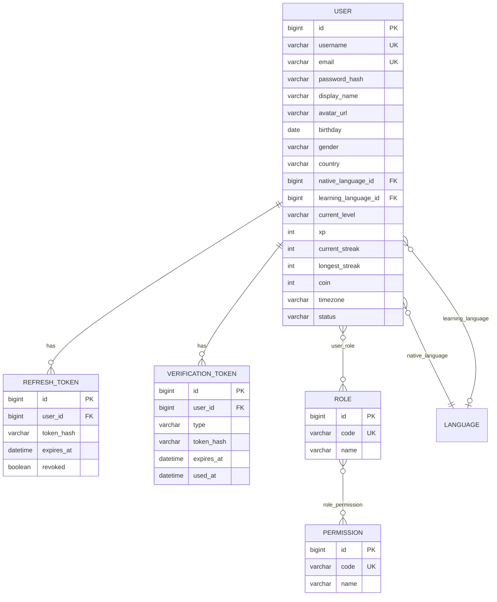
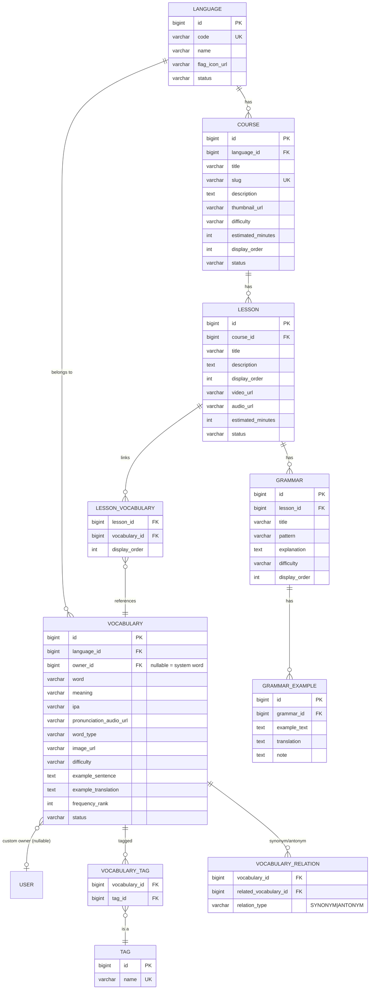
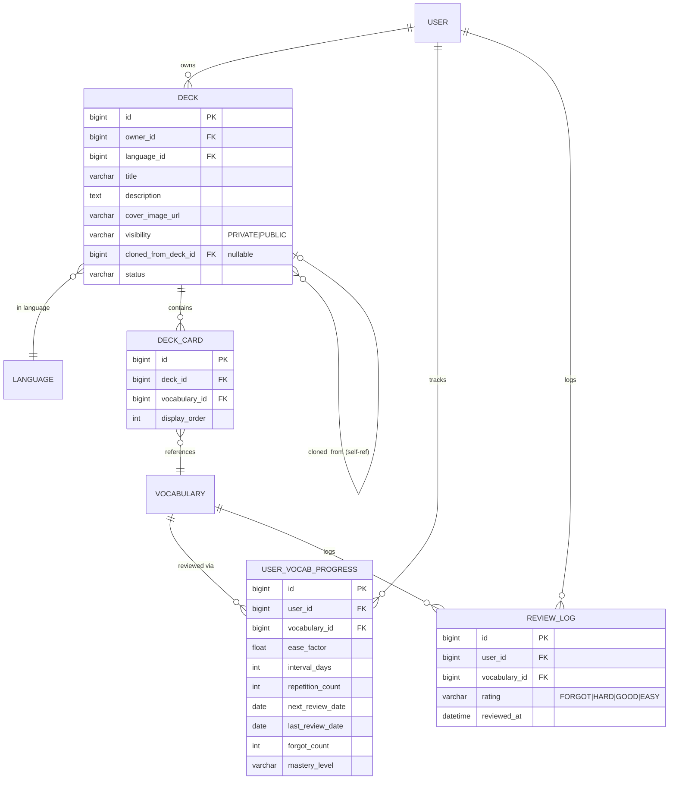
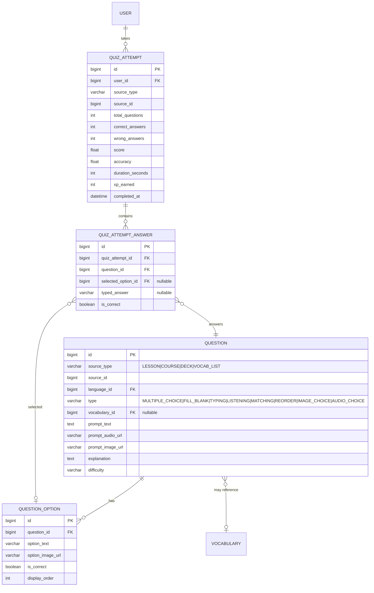
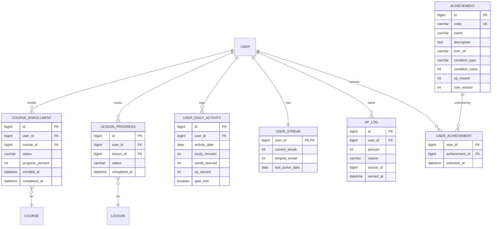
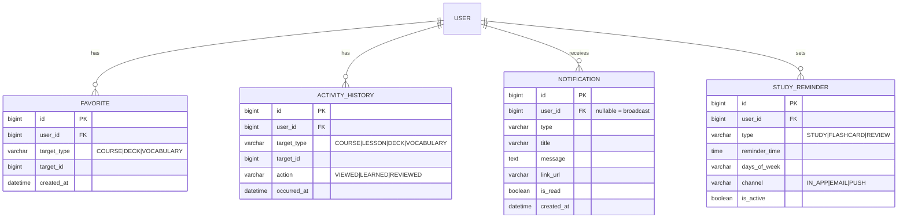

# Language Learning Platform — Project Overview & Architecture

> Tài liệu tham chiếu chính (single source of truth) cho toàn bộ dự án: mục tiêu, kiến trúc, data model, API, và roadmap. Mọi module khi triển khai phải bám theo tài liệu này; nếu phát sinh thay đổi kiến trúc, cập nhật tài liệu này trước khi code.

## 1. Tổng quan dự án

Website học ngoại ngữ, giai đoạn đầu tập trung tiếng Anh, kiến trúc hỗ trợ mở rộng đa ngôn ngữ (Nhật, Hàn, Trung, Pháp, Đức...) mà không cần redesign. Lấy cảm hứng trải nghiệm từ Duolingo/Quizlet/Anki/MochiMochi nhưng là hệ thống độc lập.

Hai phương pháp học song song:

- **Course-based**: `Language → Course → Lesson → (Vocabulary + Grammar + Quiz)`, lộ trình do Admin xây dựng sẵn.
- **Deck-based**: người dùng tự tạo `Deck`, thêm từ vựng, học Flashcard, ôn tập bằng Spaced Repetition, làm Quiz từ Deck. Deck có thể Public để người khác tìm và clone.

**Stack:** Backend Java 21 + Spring Boot 3 + MySQL + JWT; Frontend React + Vite + TypeScript + Bootstrap 5. Không dùng Flyway ở giai đoạn đầu, không dùng Tailwind/MUI.

---

## 2. Quyết định thiết kế cốt lõi

Đây là các quyết định đã chốt, áp dụng xuyên suốt toàn bộ hệ thống — không lặp lại review, mọi phần dưới đây (ERD, API, roadmap) đã phản ánh các quyết định này.

| # | Quyết định | Lý do |
|---|---|---|
| D1 | `Vocabulary` là từ điển **dùng chung** duy nhất (theo `Language`, có `ownerId` nullable cho từ custom). `Lesson` và `Deck` chỉ **liên kết** tới `Vocabulary` qua bảng join, không copy dữ liệu. | Một từ chỉ tồn tại một nơi; tránh trùng lặp dữ liệu và trạng thái ghi nhớ không đồng nhất. |
| D2 | SRS progress (`UserVocabularyProgress`) khoá theo **`(user, vocabulary)`**, không theo deck/lesson. | Một từ dù học ở Lesson hay ở nhiều Deck khác nhau vẫn chỉ có **một** mức độ ghi nhớ — đúng với thực tế nhận thức của người học. |
| D3 | Clone Deck = tạo `Deck` mới (owner = user hiện tại, `clonedFromDeckId` trỏ về gốc) + tạo lại `DeckCard` trỏ **cùng** `Vocabulary` gốc, không copy dữ liệu từ vựng. | Nhờ D2, tiến độ học của người clone độc lập ngay từ đầu; deck gốc bị sửa/xoá không ảnh hưởng deck đã clone. |
| D4 | Không có entity `Exercise` riêng — bài tập trong Lesson chính là `Question` với `sourceType = LESSON`. | `Exercise` và `Question` là cùng một khái niệm; tách riêng sẽ tạo hai entity trùng lặp. |
| D5 | Không có entity `Quiz` tĩnh phải soạn trước. `Question` là ngân hàng câu hỏi gắn với nguồn (`sourceType/sourceId`); khi user bấm "Làm Quiz", backend **generate động** N câu, random thứ tự câu/đáp án. Kết quả lưu vào `QuizAttempt`. | Cho phép user chọn 10/20/50/tất cả câu linh hoạt mà không cần tạo trước hàng loạt `Quiz` entity. |
| D6 | Không có entity `Flashcard` riêng — "Flashcard" chỉ là **chế độ hiển thị** (front/back) của `Vocabulary` thông qua `DeckCard`/`LessonVocabulary`. | Tránh entity trùng dữ liệu với `Vocabulary`. |
| D7 | RBAC: thiết kế schema `role` / `permission` / `role_permission` đầy đủ ngay từ đầu, nhưng logic MVP chỉ check `hasRole('ADMIN'/'USER')`. | Mở rộng permission chi tiết sau này (Editor, Moderator...) chỉ cần thêm dữ liệu + đổi `hasRole` → `hasAuthority`, không phải sửa schema (quan trọng vì không dùng Flyway). |
| D8 | Thêm bảng `XpLog` (append-only ledger: `userId, amount, reason, earnedAt`) bên cạnh cột `User.xp` (denormalized, cộng dồn). | Leaderboard Weekly/Monthly cần `SUM(amount) WHERE earned_at BETWEEN ...` — không thể làm được nếu chỉ có một cột XP cộng dồn all-time. |
| D9 | Chia 2 nhóm entity: **Content/Master data** (User, Course, Lesson, Vocabulary, Deck...) dùng `AuditableEntity` đầy đủ (soft-delete có ý nghĩa); **Log/Transaction data** (`XpLog`, `ReviewLog`, `ActivityHistory`, `QuizAttemptAnswer`) chỉ có `id + createdAt`, không audit/soft-delete. | Log tần suất cao mà mang đủ audit fields sẽ phình bảng và bắt buộc filter `is_deleted` trên hàng triệu dòng không cần thiết. |
| D10 | `User` có cột `timezone`. Mọi hoạt động ghi vào `UserDailyActivity.activityDate` (`LocalDate`) tính theo timezone của user, không theo UTC server. Streak cập nhật **theo sự kiện** (lúc ghi activity), không chạy cron quét toàn bộ user mỗi đêm. | Tránh bug kinh điển lệch ngày giữa các user ở nhiều múi giờ; tránh batch job nặng. |
| D11 | MVP: `Vocabulary.meaning`/`exampleTranslation` cố định tiếng Việt, không có bảng dịch đa chiều theo `nativeLanguage`. | Đúng nhu cầu thực tế hiện tại; bảng `VocabularyTranslation` đa ngôn ngữ hiển thị là over-engineering nếu chưa có nhu cầu — để Phase 2/3. |
| D12 | `Favorite` và `ActivityHistory` dùng generic `targetType/targetId` thay vì bảng riêng cho từng loại (Course/Deck/Vocabulary). | Thêm loại mới (vd Favorite Grammar) không cần migration; đánh đổi mất FK constraint DB thật, validate ở Service layer. |

---

## 3. Bảo mật cấu hình — đã xử lý ở Giai đoạn 1

Repo lúc bắt đầu dự án (`language-learning-backend`) chỉ có skeleton mặc định, và `application.properties` từng lộ **JWT secret dạng plaintext** đã bị commit vào git. Đã xử lý xong trong Giai đoạn 1:

1. ✅ `spring.datasource.url/username/password`, `jwt.secret` đã chuyển sang biến môi trường (`${DB_URL}`, `${DB_PASSWORD}`, `${JWT_SECRET}`...) — giá trị thật đặt trong `application-local.properties` (gitignored, profile `local` bật mặc định). Xem `docs/dev/CODING_CONVENTIONS.md` mục 3.
2. ✅ JWT secret đã được xoay vòng — không còn dùng lại giá trị cũ từng lộ trong lịch sử git.
3. ✅ Đã bổ sung `springdoc-openapi` (Swagger) và `mapstruct` vào `pom.xml`.

---

## 4. Kiến trúc tổng thể

```
┌─────────────────┐        HTTPS/REST + JWT        ┌──────────────────────┐
│  React SPA        │ ─────────────────────────────▶ │ Spring Boot API       │
│  (Vite + TS)       │ ◀───────────────────────────── │ (modular monolith)    │
└─────────────────┘                                 └──────────┬───────────┘
                                                                 │ JPA/Hibernate
                                                                 ▼
                                                        ┌─────────────────┐
                                                        │     MySQL         │
                                                        └─────────────────┘
```

Modular monolith (không microservices) — phù hợp quy mô hiện tại, dễ deploy/maintain một mình, nhưng tách domain rõ theo package để sau này tách microservice không phải viết lại logic. Access token JWT stateless; Refresh token lưu DB (hashed, revocable).

---

## 5. Module chính

| Nhóm | Module |
|---|---|
| **Identity** | auth, user, role (gồm permission) |
| **Content** | language, course, lesson, vocabulary, grammar |
| **Practice** | quiz (question + quiz-attempt) |
| **Personal Learning** | deck (gồm deck-card) |
| **Memory** | review (SRS: user-vocab-progress, review-log) |
| **Progress & Gamification** | progress (enrollment, lesson-progress, daily-activity), gamification (streak, xp, achievement, leaderboard) |
| **Engagement** | favorite, history, notification (gồm reminder), search |
| **Admin** | admin (analytics/dashboard, không có entity riêng) |

---

## 6. Data Model (ERD)

### 6.1 Identity & Auth



### 6.2 Content: Language → Course → Lesson → Vocabulary/Grammar



### 6.3 Deck / Flashcard / SRS



`USER_VOCAB_PROGRESS` UNIQUE `(user_id, vocabulary_id)` — nền tảng cho D2/D3.

### 6.4 Quiz



### 6.5 Progress & Gamification



### 6.6 Engagement (Favorite / History / Notification / Reminder)



---

## 7. Backend Architecture

### 7.1 Package theo domain

```
com.languagelearning.language_learning_backend
├── common/
│   ├── entity/        (BaseEntity, AuditableEntity)
│   ├── dto/            (ApiResponse<T>, PageResponse<T>, ApiErrorResponse)
│   ├── constant/        (ErrorCode, ErrorMessage, CommonMessage - message/error code không hardcode rải rác trong code)
│   ├── enums/          (Status, Difficulty...)
│   └── util/
├── config/              (SecurityConfig, CorsConfig, OpenApiConfig, JpaAuditingConfig)
├── exception/           (GlobalExceptionHandler, custom exceptions)
├── security/            (JwtService, JwtAuthFilter, UserDetailsServiceImpl, CustomUserDetails)
├── auth/
├── user/
├── role/                (role + permission)
├── language/
├── course/
├── lesson/
├── vocabulary/
├── grammar/
├── deck/                (deck + deck-card)
├── review/              (SRS: user-vocab-progress, review-log)
├── quiz/                (question + quiz-attempt)
├── progress/            (enrollment, lesson-progress, daily-activity)
├── gamification/        (streak, xp, achievement, leaderboard)
├── favorite/
├── history/
├── notification/        (notification + reminder)
├── search/
└── admin/               (analytics/dashboard queries, controller /api/admin/**)
```

Trong module nghiệp vụ (ví dụ `vocabulary/`):

```
vocabulary/
├── controller/   VocabularyController, AdminVocabularyController
├── service/      VocabularyService (interface)
├── service/impl/ VocabularyServiceImpl
├── repository/   VocabularyRepository (+ VocabularySpecification nếu cần filter động)
├── entity/       Vocabulary, VocabularyRelation, VocabularyTag
├── dto/
│   ├── request/  VocabularyCreateRequest, VocabularyUpdateRequest
│   └── response/ VocabularyResponse, VocabularySummaryResponse
└── mapper/       VocabularyMapper (MapStruct)
```

Module đơn giản (vd `favorite/`) chỉ cần `controller/service/repository/entity/dto`.

### 7.2 Nguyên tắc bắt buộc

- Controller mỏng — chỉ nhận request, gọi service, trả `ApiResponse<T>`.
- Business logic 100% trong Service; Repository chỉ truy vấn.
- Không trả Entity trực tiếp ra API — luôn qua DTO Response.
- User hiện tại lấy qua `SecurityContextHolder` → `CustomUserDetails.getUserId()`, không nhận `userId` từ FE.
- Check ownership ở Service (vd `DeckService.update`: `deck.ownerId != currentUserId` → `ForbiddenException`).
- `@PreAuthorize("hasRole('ADMIN')")` cho mọi endpoint `/api/admin/**`.
- List API dùng `Pageable`, trả `PageResponse<T>` bọc trong `ApiResponse`.

### 7.3 `ApiResponse<T>` — đã triển khai ở Giai đoạn 1

```java
public class ApiResponse<T> {
    private int code;
    private String message;
    private T data;

    public static <T> ApiResponse<T> success(T data) { ... }         // message mặc định CommonMessage.SUCCESS
    public static <T> ApiResponse<T> success(String message, T data) { ... }
}

public class ApiErrorResponse {
    private int code;
    private String errorCode;   // vd RESOURCE_NOT_FOUND - xem docs/dev/ERROR_CODE_CATALOG.md
    private String message;
    private List<FieldError> errors;
}
```

Message/errorCode không hardcode trực tiếp trong các class trên — lấy từ `common/constant/CommonMessage`, `ErrorCode`, `ErrorMessage` (xem `docs/dev/CODING_CONVENTIONS.md` mục 1.2).

---

## 8. Frontend Architecture

```
src/
├── api/            (axiosClient.ts, interceptors)
├── assets/
├── components/     (components/vocabulary, components/deck, components/common...)
├── contexts/        (AuthContext, ThemeContext)
├── hooks/           (useAuth, useDebounce, usePagination)
├── layouts/         (PublicLayout, UserLayout, AdminLayout)
├── pages/           (pages/auth, pages/dashboard, pages/deck, pages/admin...)
├── routes/           (AppRoutes.tsx, PublicRoute, ProtectedRoute, AdminRoute)
├── services/         (authService.ts, courseService.ts...)
├── types/            (khớp Response DTO backend)
├── constants/
└── styles/
```

Access token lưu in-memory (Context), **không** localStorage. Refresh token nên là httpOnly cookie do backend set. Axios interceptor: 401 → thử refresh 1 lần → thất bại → clear context → redirect `/login`.

---

## 9. REST API chính

| Method | Endpoint | Ghi chú |
|---|---|---|
| POST | `/api/auth/register` | public |
| POST | `/api/auth/login` | public |
| POST | `/api/auth/refresh-token` | public, đọc refresh token từ cookie |
| POST | `/api/auth/logout` | protected, revoke refresh token |
| POST | `/api/auth/forgot-password` | public |
| POST | `/api/auth/reset-password` | public |
| GET | `/api/auth/verify-email` | public |
| GET/PUT | `/api/users/me` | protected |
| PUT | `/api/users/me/password` | protected |
| GET | `/api/languages` | public |
| GET/POST/PUT/DELETE | `/api/admin/languages/**` | admin |
| GET | `/api/courses?languageId=&level=&keyword=&page=` | public, pagination |
| GET | `/api/courses/{id}` | public |
| POST | `/api/courses/{id}/enroll` | protected |
| GET/POST/PUT/DELETE | `/api/admin/courses/**` | admin |
| GET | `/api/courses/{courseId}/lessons` | public |
| GET | `/api/lessons/{id}` | public (đầy đủ nếu đã enroll, preview nếu chưa) |
| POST | `/api/lessons/{id}/complete` | protected |
| GET | `/api/vocabularies?languageId=&keyword=&page=` | public |
| GET/POST/PUT/DELETE | `/api/admin/vocabularies/**` | admin |
| GET | `/api/decks?visibility=PUBLIC&keyword=` | public search deck |
| GET/POST/PUT/DELETE | `/api/decks/**` | protected, ownership check |
| POST | `/api/decks/{id}/cards` | protected |
| POST | `/api/decks/{id}/clone` | protected |
| GET | `/api/review/today` | protected |
| POST | `/api/review/{vocabularyId}` | protected — rating FORGOT/HARD/GOOD/EASY |
| POST | `/api/quizzes/generate` | protected — body: `{sourceType, sourceId, questionCount}` |
| POST | `/api/quizzes/attempts` | protected — submit + chấm điểm |
| GET | `/api/quizzes/attempts` | protected — lịch sử |
| GET | `/api/progress/dashboard` | protected |
| GET | `/api/leaderboard?period=WEEKLY` | protected |
| GET/PUT/DELETE | `/api/favorites/**` | protected |
| GET | `/api/history/recent` | protected |
| GET/PUT | `/api/notifications/**` | protected |
| GET | `/api/search?q=&type=` | public |
| GET | `/api/admin/dashboard` | admin |

---

## 10. Rủi ro kỹ thuật cần lưu ý

1. **N+1 query**: `Course → Lesson → Vocabulary` — dùng `@EntityGraph` hoặc JPQL DTO projection, không lazy-load rồi loop.
2. **Circular JSON**: tránh nhờ mọi thứ đi qua DTO (7.2); nếu có bidirectional mapping trong entity, `@JsonIgnore` phía "many".
3. **`ddl-auto=update`** chấp nhận ở dev, nhưng Giai đoạn 10 (Production) bắt buộc chuyển Flyway/Liquibase.
4. **Leaderboard query** cần index `(earned_at, user_id)` trên `xp_log`; cache vài phút (Caffeine/Redis) nếu số user lớn.
5. **Soft-delete quên filter**: thêm `@SQLRestriction("is_deleted = false")` (Hibernate 6, thay cho `@Where` đã deprecated) ngay trên từng entity kế thừa `AuditableEntity` — annotation này **không** được kế thừa tự động từ `@MappedSuperclass`, phải khai báo lại ở mỗi entity con, không để Service tự nhớ filter thủ công.
6. **Search**: MVP dùng `LIKE` + index MySQL là đủ; không tích hợp Elasticsearch khi chưa có nhu cầu thật.
7. **Không lộ thông tin nội bộ qua response lỗi**: `GlobalExceptionHandler` chỉ log đầy đủ stack trace phía server, **không bao giờ** trả stack trace/chi tiết kỹ thuật (tên bảng, câu SQL, đường dẫn file...) ra response cho client — xem `docs/dev/ERROR_CODE_CATALOG.md` mục 4.

---

## 11. MVP vs Phase 2 vs Phase 3

**MVP**: Auth đầy đủ (email verify có thể log link ra console ở dev) · Language/Course/Lesson/Vocabulary/Grammar (CRUD admin + xem cho user) · Quiz cơ bản (Multiple Choice, Fill Blank) generate từ Lesson/Deck · Deck (CRUD, add/remove vocabulary, clone) · Flashcard learning (Normal/Reverse/Shuffle) · SRS cơ bản (SM-2, Review Today) · Progress dashboard cơ bản · Streak + Daily Goal + XP đơn giản.

**Phase 2**: Achievement + Leaderboard đầy đủ · Notification/Reminder (Email/Push thật) · Favorite/History UI đầy đủ · Admin Analytics có biểu đồ · Quiz nâng cao (Listening/Matching/Reorder/Image/Audio Choice) · Import/Export (CSV/Anki) · Permission chi tiết (vượt ADMIN/USER) · Search nâng cao.

**Phase 3+**: Payment/Premium, Study Plan AI, Social, AI features, Mobile/PWA.

---

## 12. Roadmap theo giai đoạn

| Giai đoạn | Nội dung | Trạng thái |
|---|---|---|
| 1. Setup | BaseEntity/AuditableEntity, ApiResponse, GlobalExceptionHandler, env vars, cấu trúc thư mục FE/BE, Swagger, MapStruct, SecurityConfig tối thiểu[^1] | ✅ Hoàn thành |
| 2. Authentication | User, Role, Permission (schema), Register/Login/JWT/Refresh Token, Protected Route FE | 🔄 Đang thực hiện — schema + Register/Login xong |
| 3. Course System | Language, Course, Lesson, Vocabulary, Grammar — Admin CRUD + User view + Lesson learning | ⏳ Chưa bắt đầu |
| 4. Quiz | Question, QuestionOption, generate động theo `sourceType`, QuizAttempt, chấm điểm, lịch sử | ⏳ Chưa bắt đầu |
| 5. Deck | Deck, DeckCard, Public/Private, Clone, Flashcard learning modes | ⏳ Chưa bắt đầu |
| 6. Spaced Repetition | UserVocabularyProgress, ReviewLog, SM-2, Review Today | ⏳ Chưa bắt đầu |
| 7. Progress & Gamification | CourseEnrollment, LessonProgress, UserDailyActivity, UserStreak, XpLog, Achievement, Leaderboard | ⏳ Chưa bắt đầu |
| 8. Engagement | Favorite, ActivityHistory, Notification, StudyReminder, Search | ⏳ Chưa bắt đầu |
| 9. Admin & Analytics | Admin Dashboard, thống kê User/Course/Learning | ⏳ Chưa bắt đầu |
| 10. Production | Testing, Flyway/Liquibase, Performance, Security hardening, Docker, Logging, Monitoring | ⏳ Chưa bắt đầu |

Mỗi module triển khai theo quy trình 11 bước: phân tích → entity → quan hệ DB → API → Request DTO → Response DTO → Repository → Service → Controller → Security → code, kèm hướng dẫn test Postman/FE sau khi hoàn thành.

[^1]: Phát sinh ngoài kế hoạch ban đầu khi triển khai thực tế: Spring Security (đã có sẵn trong `pom.xml` từ đầu) tự động khoá mọi endpoint kể cả Swagger UI khi chưa có `SecurityConfig` nào — phải thêm 1 config tối thiểu (chỉ `permitAll` cho `/swagger-ui/**`, `/v3/api-docs/**`) để Swagger dùng được. Sẽ được thay thế bằng JWT filter chain đầy đủ ở Giai đoạn 2.

---

## 13. Bước tiếp theo

**Giai đoạn 1 — Project Setup: ✅ Hoàn thành.** Đã có: biến môi trường + JWT secret xoay vòng, `BaseEntity`/`AuditableEntity` + JPA Auditing, `common/constant` (ErrorCode/ErrorMessage/CommonMessage), bộ Exception nghiệp vụ + `GlobalExceptionHandler`, `ApiResponse`/`PageResponse`/`ApiErrorResponse`, Swagger/OpenAPI + MapStruct trong `pom.xml`, `SecurityConfig` tối thiểu, cấu trúc thư mục frontend + axios client + routing skeleton. Toàn bộ đã build/chạy/test thật, đã commit và push lên GitHub (xem lịch sử commit từng repo).

**Giai đoạn 2 — Authentication: 🔄 Đang thực hiện.** Đã xong: entity `User`/`Role`/`Permission`/`RefreshToken`/`VerificationToken` + repository, `RoleSeeder`, `SecurityConfig` full JWT filter chain (`JwtService`, `JwtAuthenticationFilter`, `JwtAuthenticationEntryPoint`, `JwtAccessDeniedHandler`, `CustomUserDetails`), Auth error code/message riêng (`common/constant` + `auth/exception`), `POST /api/auth/register` + `POST /api/auth/login` (Service + Controller) — đã test thật qua curl toàn bộ case (thành công, trùng username/email, sai mật khẩu, từng trạng thái tài khoản DISABLED/LOCKED/PENDING_VERIFICATION, token hợp lệ gọi được route bảo vệ), có Unit Test cho `AuthService` (10 case). Phát hiện và sửa 1 bug thật khi test: `UserRepository.findByUsernameOrEmail` thiếu `JOIN FETCH roles` gây `LazyInitializationException` trong `JwtAuthenticationFilter` (chạy ngoài transaction) — đã fix.

Còn lại của Giai đoạn 2: Refresh Token (`POST /api/auth/refresh-token`), Logout (`POST /api/auth/logout`), Forgot/Reset Password, Verify Email (`GET /api/auth/verify-email`), `GET/PUT /api/users/me` + đổi mật khẩu, và toàn bộ Frontend (AuthContext, Login/Register page, ProtectedRoute, axios interceptor refresh token).

Bước tiếp theo: tiếp tục Giai đoạn 2 — Refresh Token + Logout trước, sau đó Forgot/Reset Password + Verify Email, cuối cùng Frontend.
