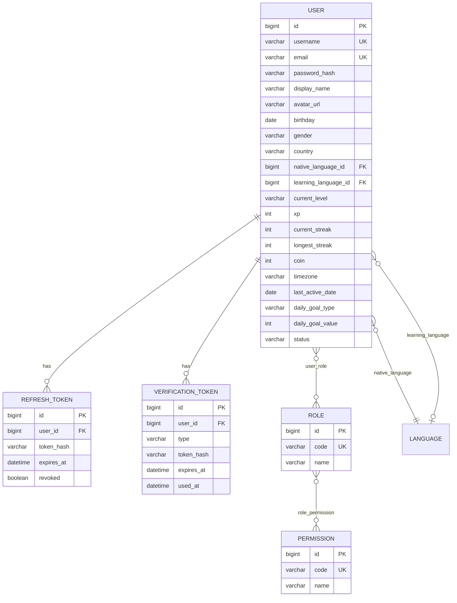
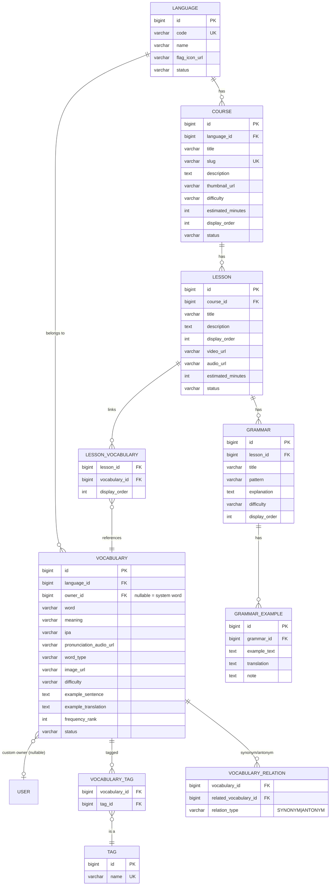
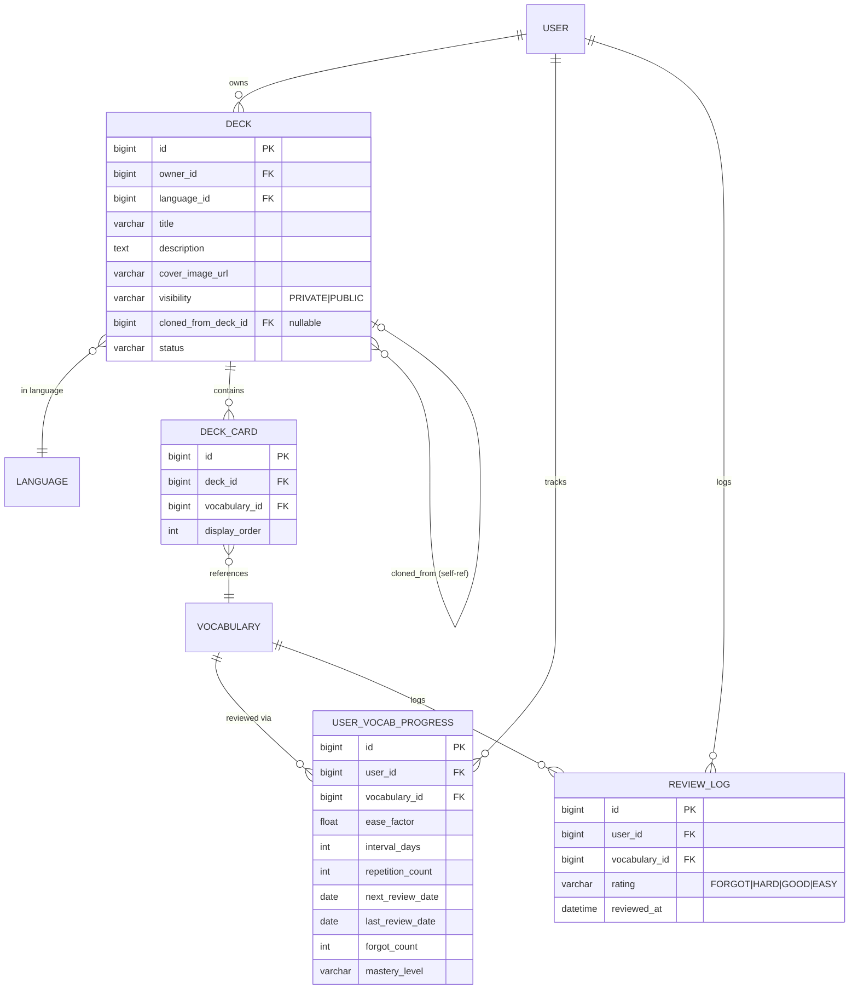
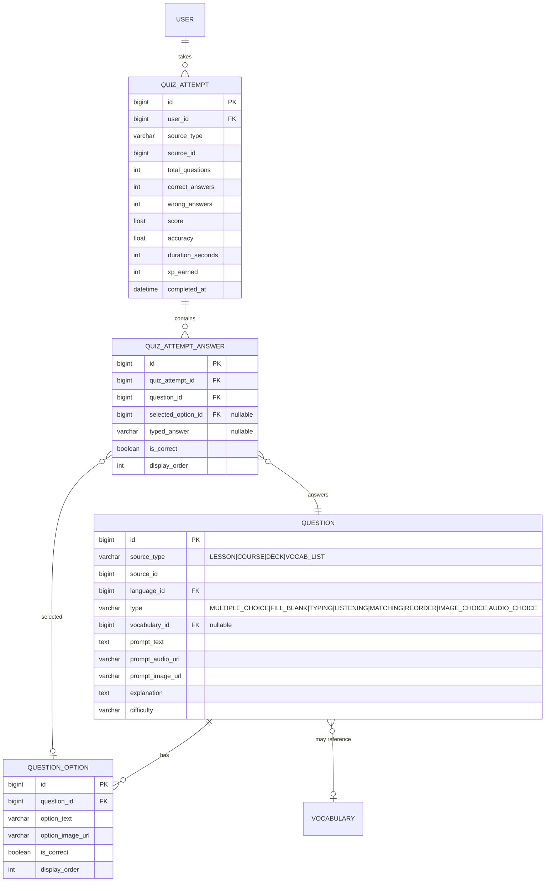
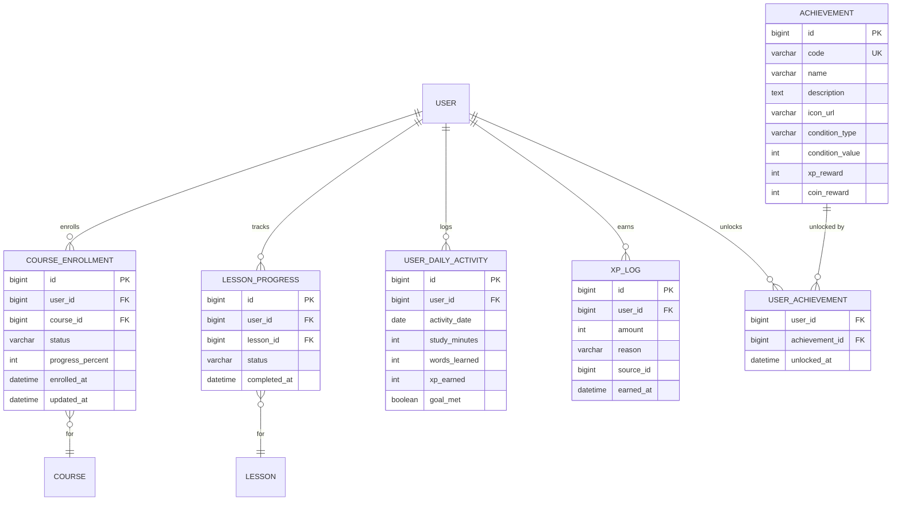
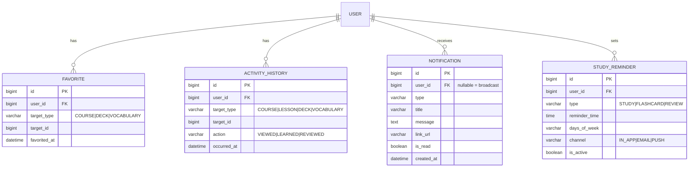

# Language Learning Platform — Project Overview & Architecture

> Tài liệu tham chiếu chính (single source of truth) cho toàn bộ dự án: mục tiêu, kiến trúc, data model, API, và roadmap. Mọi module khi triển khai phải bám theo tài liệu này; nếu phát sinh thay đổi kiến trúc, cập nhật tài liệu này trước khi code.

## 1. Tổng quan dự án

Website học ngoại ngữ, giai đoạn đầu tập trung tiếng Anh, kiến trúc hỗ trợ mở rộng đa ngôn ngữ (Nhật, Hàn, Trung, Pháp, Đức...) mà không cần redesign. Lấy cảm hứng trải nghiệm từ Duolingo/Quizlet/Anki/MochiMochi nhưng là hệ thống độc lập.

Hai phương pháp học song song:

- **Course-based**: `Language → Course → Lesson → (Vocabulary + Grammar + Quiz)`, lộ trình do Admin xây dựng sẵn.
- **Deck-based**: người dùng tự tạo `Deck`, thêm từ vựng, học Flashcard, ôn tập bằng Spaced Repetition, làm Quiz từ Deck. Deck có thể Public để người khác tìm và clone.

**Stack:** Backend Java 21 + Spring Boot 3 + MySQL + JWT; Frontend React + Vite + TypeScript + Bootstrap 5. Không dùng Flyway ở giai đoạn đầu, không dùng Tailwind/MUI.

---

## 2. Quyết định thiết kế cốt lõi

Đây là các quyết định đã chốt, áp dụng xuyên suốt toàn bộ hệ thống — không lặp lại review, mọi phần dưới đây (ERD, API, roadmap) đã phản ánh các quyết định này.

| # | Quyết định | Lý do |
|---|---|---|
| D1 | `Vocabulary` là từ điển **dùng chung** duy nhất (theo `Language`, có `ownerId` nullable cho từ custom). `Lesson` và `Deck` chỉ **liên kết** tới `Vocabulary` qua bảng join, không copy dữ liệu. | Một từ chỉ tồn tại một nơi; tránh trùng lặp dữ liệu và trạng thái ghi nhớ không đồng nhất. |
| D2 | SRS progress (`UserVocabularyProgress`) khoá theo **`(user, vocabulary)`**, không theo deck/lesson. | Một từ dù học ở Lesson hay ở nhiều Deck khác nhau vẫn chỉ có **một** mức độ ghi nhớ — đúng với thực tế nhận thức của người học. |
| D3 | Clone Deck = tạo `Deck` mới (owner = user hiện tại, `clonedFromDeckId` trỏ về gốc) + tạo lại `DeckCard` trỏ **cùng** `Vocabulary` gốc, không copy dữ liệu từ vựng. | Nhờ D2, tiến độ học của người clone độc lập ngay từ đầu; deck gốc bị sửa/xoá không ảnh hưởng deck đã clone. |
| D4 | Không có entity `Exercise` riêng — bài tập trong Lesson chính là `Question` với `sourceType = LESSON`. | `Exercise` và `Question` là cùng một khái niệm; tách riêng sẽ tạo hai entity trùng lặp. |
| D5 | Không có entity `Quiz` tĩnh phải soạn trước. `Question` là ngân hàng câu hỏi gắn với nguồn (`sourceType/sourceId`); khi user bấm "Làm Quiz", backend **generate động** N câu, random thứ tự câu/đáp án. Kết quả lưu vào `QuizAttempt`. | Cho phép user chọn 10/20/50/tất cả câu linh hoạt mà không cần tạo trước hàng loạt `Quiz` entity. |
| D6 | Không có entity `Flashcard` riêng — "Flashcard" chỉ là **chế độ hiển thị** (front/back) của `Vocabulary` thông qua `DeckCard`/`LessonVocabulary`. | Tránh entity trùng dữ liệu với `Vocabulary`. |
| D7 | RBAC: thiết kế schema `role` / `permission` / `role_permission` đầy đủ ngay từ đầu, nhưng logic MVP chỉ check `hasRole('ADMIN'/'USER')`. | Mở rộng permission chi tiết sau này (Editor, Moderator...) chỉ cần thêm dữ liệu + đổi `hasRole` → `hasAuthority`, không phải sửa schema (quan trọng vì không dùng Flyway). |
| D8 | Thêm bảng `XpLog` (append-only ledger: `userId, amount, reason, earnedAt`) bên cạnh cột `User.xp` (denormalized, cộng dồn). | Leaderboard Weekly/Monthly cần `SUM(amount) WHERE earned_at BETWEEN ...` — không thể làm được nếu chỉ có một cột XP cộng dồn all-time. |
| D9 | Chia 2 nhóm entity: **Content/Master data** (User, Course, Lesson, Vocabulary, Deck...) dùng `AuditableEntity` đầy đủ (soft-delete có ý nghĩa); **Log/Transaction data** (`XpLog`, `ReviewLog`, `ActivityHistory`, `QuizAttemptAnswer`, `RefreshToken`, `VerificationToken`) chỉ kế thừa `BaseEntity` (chỉ có `id`), không audit/soft-delete — entity con tự thêm field thời gian riêng nếu nghiệp vụ cần (vd `earnedAt` ở `XpLog`, `expiresAt` ở `RefreshToken`/`VerificationToken`), không có `createdAt` mặc định từ base class. | Log tần suất cao mà mang đủ audit fields sẽ phình bảng và bắt buộc filter `is_deleted` trên hàng triệu dòng không cần thiết. |
| D10 | `User` có cột `timezone`. Mọi hoạt động ghi vào `UserDailyActivity.activityDate` (`LocalDate`) tính theo timezone của user, không theo UTC server. Streak cập nhật **theo sự kiện** (lúc ghi activity), không chạy cron quét toàn bộ user mỗi đêm. | Tránh bug kinh điển lệch ngày giữa các user ở nhiều múi giờ; tránh batch job nặng. |
| D11 | MVP: `Vocabulary.meaning`/`exampleTranslation` cố định tiếng Việt, không có bảng dịch đa chiều theo `nativeLanguage`. | Đúng nhu cầu thực tế hiện tại; bảng `VocabularyTranslation` đa ngôn ngữ hiển thị là over-engineering nếu chưa có nhu cầu — để Phase 2/3. |
| D12 | `Favorite` và `ActivityHistory` dùng generic `targetType/targetId` thay vì bảng riêng cho từng loại (Course/Deck/Vocabulary). | Thêm loại mới (vd Favorite Grammar) không cần migration; đánh đổi mất FK constraint DB thật, validate ở Service layer. |

---

## 3. Bảo mật cấu hình — đã xử lý ở Giai đoạn 1

Repo lúc bắt đầu dự án (`language-learning-backend`) chỉ có skeleton mặc định, và `application.properties` từng lộ **JWT secret dạng plaintext** đã bị commit vào git. Đã xử lý xong trong Giai đoạn 1:

1. ✅ `spring.datasource.url/username/password`, `jwt.secret` đã chuyển sang biến môi trường (`${DB_URL}`, `${DB_PASSWORD}`, `${JWT_SECRET}`...) — giá trị thật đặt trong `application-local.properties` (gitignored, profile `local` bật mặc định). Xem `docs/dev/CODING_CONVENTIONS.md` mục 3.
2. ✅ JWT secret đã được xoay vòng — không còn dùng lại giá trị cũ từng lộ trong lịch sử git.
3. ✅ Đã bổ sung `springdoc-openapi` (Swagger) và `mapstruct` vào `pom.xml`.

---

## 4. Kiến trúc tổng thể

```
┌─────────────────┐        HTTPS/REST + JWT        ┌──────────────────────┐
│  React SPA        │ ─────────────────────────────▶ │ Spring Boot API       │
│  (Vite + TS)       │ ◀───────────────────────────── │ (modular monolith)    │
└─────────────────┘                                 └──────────┬───────────┘
                                                                 │ JPA/Hibernate
                                                                 ▼
                                                        ┌─────────────────┐
                                                        │     MySQL         │
                                                        └─────────────────┘
```

Modular monolith (không microservices) — phù hợp quy mô hiện tại, dễ deploy/maintain một mình, nhưng tách domain rõ theo package để sau này tách microservice không phải viết lại logic. Access token JWT stateless; Refresh token lưu DB (hashed, revocable).

---

## 5. Module chính

| Nhóm | Module |
|---|---|
| **Identity** | auth, user, role (gồm permission) |
| **Content** | language, course, lesson, vocabulary, grammar |
| **Practice** | quiz (question + quiz-attempt) |
| **Personal Learning** | deck (gồm deck-card) |
| **Memory** | review (SRS: user-vocab-progress, review-log) |
| **Progress & Gamification** | progress (enrollment, lesson-progress, daily-activity), gamification (streak, xp, achievement, leaderboard) |
| **Engagement** | favorite, history, notification (gồm reminder), search |
| **Admin** | admin (analytics/dashboard, không có entity riêng) |

---

## 6. Data Model (ERD)

### 6.1 Identity & Auth



> **Lưu ý:** `native_language_id`/`learning_language_id` và quan hệ tới `LANGUAGE` ở trên là thiết kế cho **Giai đoạn 3** (khi entity `Language` tồn tại) — **chưa có trong code hiện tại**. `User.java` hiện chưa có 2 cột này (xem comment trong entity + `docs/dev/SCHEMA_CHANGE_LOG.md`).
>
> `last_active_date`/`daily_goal_type`/`daily_goal_value` được bổ sung ở **Giai đoạn 7** (`daily_goal_*` theo đặc tả gốc thuộc Giai đoạn 2 mục "Learning Settings" nhưng chưa từng được code, chỉ phát hiện khi làm Progress Dashboard cần dùng). `current_streak`/`longest_streak` giữ nguyên denormalized trên `USER` — **không có bảng `USER_STREAK` riêng** dù mục 6.5 phía dưới có thể gợi ý vậy, tránh 2 nguồn sự thật cho cùng giá trị.

### 6.2 Content: Language → Course → Lesson → Vocabulary/Grammar



### 6.3 Deck / Flashcard / SRS



`USER_VOCAB_PROGRESS` UNIQUE `(user_id, vocabulary_id)` — nền tảng cho D2/D3.

### 6.4 Quiz



### 6.5 Progress & Gamification



> **Trạng thái implement (2026-07-30):** `COURSE_ENROLLMENT`/`LESSON_PROGRESS` (Giai đoạn 3), `USER_DAILY_ACTIVITY`/`XP_LOG` (Giai đoạn 7 — dual-write `User.xp`+`XpLog` theo D8, `goalMet`/Streak tính qua `DailyActivityService`/`StreakService`) **đã có trong code**, xem `docs/dev/SCHEMA_CHANGE_LOG.md`. `ACHIEVEMENT`/`USER_ACHIEVEMENT` **chưa có trong code** — Phase 2 (mục 11), `XpLog.reason=ACHIEVEMENT` đã có sẵn trong enum để không phải đổi schema khi làm Phase 2 nhưng chưa được dùng.

### 6.6 Engagement (Favorite / History / Notification / Reminder)



> **Trạng thái implement (2026-08-01):** `FAVORITE`, `ACTIVITY_HISTORY`, `NOTIFICATION`, `STUDY_REMINDER` (Giai đoạn 8) **đã có trong code**, xem `docs/dev/SCHEMA_CHANGE_LOG.md`. `ACTIVITY_HISTORY` chỉ ghi log cho 3 luồng có Test Case cụ thể (xem `action` VIEWED/LEARNED/REVIEWED trong `docs/testing/18_FRS_TC_FAVORITE_HISTORY.md`) — chưa ghi VIEWED khi xem Lesson/Deck/Vocabulary detail, cố tình để dành. `NOTIFICATION` chỉ hỗ trợ thông báo cá nhân (`userId` luôn có giá trị) — broadcast (`userId=null`) đúng ERD nhưng **chưa có đường tạo** (cần Admin Notification management, Phase 2, mục 11) nên chưa xây bảng phụ theo dõi đã đọc riêng theo user cho broadcast; hiện KHÔNG có trigger MVP nào tự động tạo Notification (Achievement unlock là Phase 2), test bằng cách seed trực tiếp DB. Gửi Email/Push thật (không phải in-app) vẫn thuộc Phase 2 (mục 11).

---

## 7. Backend Architecture

### 7.1 Package theo domain

> Cây package dưới đây là **thiết kế đầy đủ** cho toàn bộ hệ thống (giống cách section 9 liệt kê API), không phải danh sách "đã có trong code" — package nào chưa tồn tại được đánh dấu ⏳ ngay trong comment, còn lại đã có (xem `find language-learning-backend/src/main/java/.../language_learning_backend -maxdepth 1 -type d` để đối chiếu thực tế, hoặc mục 12/13 để biết giai đoạn nào đang làm).

```
com.languagelearning.language_learning_backend
├── common/
│   ├── entity/        (BaseEntity, AuditableEntity)
│   ├── dto/            (ApiResponse<T>, PageResponse<T>, ApiErrorResponse)
│   ├── constant/        (ErrorCode, ErrorMessage, CommonMessage - message/error code không hardcode rải rác trong code)
│   ├── validation/      (SafeUrl + SafeUrlValidator - custom Bean Validation dùng chung, thêm ở Giai đoạn 10 Security Audit)
│   ├── enums/          (Status, Difficulty...)
│   └── util/
├── config/              (SecurityConfig, CorsConfig, OpenApiConfig, JpaAuditingConfig)
├── exception/           (GlobalExceptionHandler, custom exceptions)
├── security/            (JwtService, JwtAuthFilter, UserDetailsServiceImpl, CustomUserDetails)
├── auth/
├── user/
├── role/                (role + permission)
├── language/
├── course/
├── lesson/
├── vocabulary/
├── grammar/
├── deck/                (deck + deck-card)
├── review/              (SRS: user-vocab-progress, review-log)
├── quiz/                (question + quiz-attempt)
├── progress/            (enrollment, lesson-progress, daily-activity)
├── gamification/        (streak, xp, achievement, leaderboard)
├── favorite/
├── history/
├── notification/        (notification + reminder)
├── search/
└── admin/               (analytics/dashboard queries, controller /api/admin/**)
```

> Lưu ý: các `Admin*Controller` theo từng entity (vd `AdminCourseController`, `AdminLessonController`, `AdminVocabularyController`...) nằm ngay trong package module tương ứng (`course/controller/`, `lesson/controller/`...), KHÔNG nằm trong package `admin/` tập trung — package `admin/` riêng ở trên (Giai đoạn 9) chỉ chứa `AdminDashboardController` (`/api/admin/dashboard`, tổng hợp số liệu nhiều module). Riêng `AdminUserController` (`/api/admin/users/**`, quản lý User) nằm trong `user/controller/` — cùng lý do đặt cạnh module nó quản lý, không đặt trong `admin/`.

Trong module nghiệp vụ (ví dụ `vocabulary/`):

```
vocabulary/
├── controller/   VocabularyController, AdminVocabularyController
├── service/      VocabularyService (interface)
├── service/impl/ VocabularyServiceImpl
├── repository/   VocabularyRepository (+ VocabularySpecification nếu cần filter động)
├── entity/       Vocabulary, VocabularyRelation, VocabularyTag
├── dto/
│   ├── request/  VocabularyCreateRequest, VocabularyUpdateRequest
│   └── response/ VocabularyResponse, VocabularySummaryResponse
└── mapper/       VocabularyMapper (MapStruct)
```

Module đơn giản (vd `favorite/`) chỉ cần `controller/service/repository/entity/dto`.

### 7.2 Nguyên tắc bắt buộc

- Controller mỏng — chỉ nhận request, gọi service, trả `ApiResponse<T>`.
- Business logic 100% trong Service; Repository chỉ truy vấn.
- Không trả Entity trực tiếp ra API — luôn qua DTO Response.
- User hiện tại lấy qua `SecurityContextHolder` → `CustomUserDetails.getUserId()`, không nhận `userId` từ FE.
- Check ownership ở Service (vd `DeckService.update`: `deck.ownerId != currentUserId` → `ForbiddenException`).
- `@PreAuthorize("hasRole('ADMIN')")` cho mọi endpoint `/api/admin/**`.
- List API dùng `Pageable`, trả `PageResponse<T>` bọc trong `ApiResponse`.

### 7.3 `ApiResponse<T>` — đã triển khai ở Giai đoạn 1

```java
public class ApiResponse<T> {
    private int code;
    private String message;
    private T data;

    public static <T> ApiResponse<T> success(T data) { ... }         // message mặc định CommonMessage.SUCCESS
    public static <T> ApiResponse<T> success(String message, T data) { ... }
}

public class ApiErrorResponse {
    private int code;
    private String errorCode;   // vd RESOURCE_NOT_FOUND - xem docs/dev/ERROR_CODE_CATALOG.md
    private String message;
    private List<FieldError> errors;
}
```

Message/errorCode không hardcode trực tiếp trong các class trên — lấy từ `common/constant/CommonMessage`, `ErrorCode`, `ErrorMessage` (xem `docs/dev/CODING_CONVENTIONS.md` mục 1.2).

---

## 8. Frontend Architecture

```
src/
├── api/            (axiosClient.ts, tokenStore.ts, apiError.ts)
├── assets/
├── components/
│   ├── ui/          (Design System atoms ✅ — Button, ButtonLink, Input, Select, Card, Badge, Spinner, Skeleton, Pagination, ProgressRing, index.ts barrel)
│   ├── dashboard/    (StatTile, TodayGoalCard, ContinueLearningCard, WeeklyProgressChart, RecentActivityList, RecommendedCourses, AchievementsPreview, LeaderboardPreview ✅ — composed component riêng cho Dashboard, mỗi component 1 file .module.scss)
│   ├── courses/      (CourseCard, CourseCardSkeleton ✅ — composed component riêng cho Course List/Detail)
│   ├── decks/        (DeckCard, DeckCardSkeleton ✅ mới — composed component riêng cho Deck List/Detail)
│   └── common/       (Navbar.tsx ✅, Logo.tsx ✅, ThemeToggle.tsx ✅, components/deck...)
├── contexts/        (AuthContext.tsx ✅, ThemeContext.tsx ✅)
├── hooks/           (useDebounce, usePagination — useAuthContext/useThemeContext nằm ngay trong Context tương ứng theo convention mục 2.1)
├── layouts/         (PublicLayout ✅, AuthLayout ✅, UserLayout ✅, AdminLayout)
├── mock/            (dashboardMock.ts ✅ — mock data riêng cho phần Dashboard chưa có API thật, xem mục 8.1)
├── pages/           (pages/auth/{LoginPage,RegisterPage,ForgotPasswordPage,ResetPasswordPage,VerifyEmailPage}.tsx ✅ — đã redesign theo Design System 2026-08-06, pages/auth/AuthForm.module.scss dùng chung, DashboardPage.tsx ✅ — đã redesign 2026-08-06 (dữ liệu thật qua ProgressDashboard + History + Course API, chỉ Achievement/Leaderboard dùng mock), pages/courses/{CourseListPage,CourseDetailPage}.tsx ✅ — đã redesign 2026-08-06 (hero banner + lesson list + sticky enroll card, dữ liệu thật), pages/lessons/LessonDetailPage.tsx ✅ — mới 2026-08-07 (Vocabulary/Grammar/Complete, gating preview theo `enrolled`), pages/lessons/VocabularyLearningPage.tsx ✅ — mới 2026-08-07 (route `/lessons/:id/vocabulary`, học từ vựng theo Lesson, đánh dấu đã học qua `POST /api/review/{vocabularyId}`), pages/decks/{DeckListPage,DeckDetailPage,FlashcardPage}.tsx ✅ — mới 2026-08-07 (Khám phá/Deck của tôi/Tạo Deck, chi tiết Deck + CRUD thẻ + Clone, Flashcard lật thẻ 3D Xuôi/Ngược/Xáo trộn), ProfilePage.tsx ✅ — chưa redesign)
├── routes/           (AppRoutes.tsx ✅, PublicRoute.tsx ✅, ProtectedRoute.tsx ✅, AdminRoute)
├── services/         (authService.ts ✅, userService.ts ✅ đủ 3 method /api/users/me, courseService.ts ✅, languageService.ts ✅, progressService.ts ✅ (GET /api/progress/dashboard), historyService.ts ✅ (GET /api/history/recent), lessonService.ts ✅, vocabularyService.ts ✅ (GET /api/vocabularies/{id}), reviewService.ts ✅ (POST /api/review/{vocabularyId}), deckService.ts ✅ mới (đủ 10 method /api/decks/**)...)
├── types/            (api.ts ✅, auth.ts ✅, user.ts ✅ — khớp 1-1 Response/Request DTO backend, progress.ts ✅ bổ sung ProgressDashboardResponse/ContinueLearningResponse, history.ts ✅ mới, lesson.ts ✅, grammar.ts ✅, vocabulary.ts ✅, review.ts ✅, deck.ts ✅ mới)
├── constants/
└── styles/          (_variables.scss ✅, _theme.scss ✅, _bootstrap.scss ✅, global.scss ✅ — xem mục 8.1)
```

**Đã implement (Giai đoạn 2):** Access token lưu in-memory (`api/tokenStore.ts`, module-level variable — không phải React state, vì `axiosClient`'s interceptor chạy ngoài component tree không dùng hook được), **không** localStorage. Refresh token là httpOnly cookie do backend set (`POST /api/auth/login`, xem mục 9) — `axiosClient` bật `withCredentials: true` để trình duyệt gửi kèm cookie, origin FE khớp `FRONTEND_URL` backend cấu hình (`CorsConfig`). Axios response interceptor: 401 (trừ chính các endpoint `/api/auth/**`, tránh vòng lặp refresh vô hạn) → gọi `POST /api/auth/refresh-token` 1 lần (gom các request 401 đồng thời lại tránh gọi refresh nhiều lần song song) → thành công thì set lại token + replay request gốc, thất bại thì `notifyAuthFailure()` cho `AuthContext` biết để clear `user` (không tự điều hướng cứng trong `axiosClient` — `ProtectedRoute` tự redirect khi thấy `user === null`). `AuthContext` khi app khởi động cũng tự gọi `refresh-token` 1 lần để khôi phục phiên đăng nhập sau khi reload trang (vì accessToken in-memory bị mất khi reload). Dùng `react-hook-form` cho Login/Register form theo đúng mục 2.2.

### 8.1 Design System (bắt đầu 2026-08-06)

Người dùng yêu cầu redesign toàn bộ Frontend đạt chất lượng sản phẩm thương mại (tham khảo phong cách Duolingo/Quizlet/Apple/Linear, không dùng UI library có sẵn — tự thiết kế). Quyết định kiến trúc đã chốt, áp dụng nhất quán cho mọi màn hình sau này:

- **Styling: SCSS + CSS Modules**, KHÔNG dùng Tailwind/MUI/AntD. Mỗi component `ui`/`common` có 1 file `*.module.scss` riêng.
- **Bootstrap 5 vẫn giữ** (đúng CLAUDE.md) nhưng chỉ lấy phần grid (`container/row/col`) + CSS reset (`reboot`) + utility class chọn lọc (flex/spacing/gap/text) qua `src/styles/_bootstrap.scss` — **cố tình không import component CSS** (`.btn`/`.card`/`.form-control`/`.navbar`...) để tránh giao diện lộ "trông giống Bootstrap mặc định". Toàn bộ component tương tác (Button/Input/Card...) tự thiết kế riêng trong `components/ui/`.
- **Design Tokens** (`src/styles/_variables.scss` — spacing/radius/typography/shadow-shape/transition không đổi theo theme; `src/styles/_theme.scss` — màu sắc dạng CSS custom property `--dl-*`, đổi được runtime theo `[data-bs-theme]`). Bảng màu: primary xanh lá emerald (tinh thần Duolingo/growth), secondary chàm indigo (Linear/Quizlet), accent vàng hổ phách (gamification: streak/XP). Font: Inter (nạp qua Google Fonts trong `index.html`).
- **Dark mode**: dùng chung attribute `data-bs-theme` trên `<html>` cho cả token `--dl-*` của mình lẫn `--bs-*` của Bootstrap — 1 lần toggle áp dụng toàn bộ. `ThemeContext` (`contexts/ThemeContext.tsx`) quản lý state + persist `localStorage`; set attribute ngay trong `<script>` inline ở `index.html` (chạy trước khi React mount) để tránh FOUC (nháy sai theme lúc tải trang).
- **Icon**: `lucide-react` (icon set, không phải UI library nên không vi phạm yêu cầu "không dùng thư viện UI có sẵn") — dùng đồng bộ toàn site, không trộn nhiều bộ icon.
- **Component Library** (`components/ui/`, export qua `index.ts` barrel): `Button` (5 variant, 3 size, ripple effect tự vẽ bằng JS + CSS animation, loading spinner tích hợp), `ButtonLink` (React Router `Link` nhìn giống `Button` — dùng khi hành động là điều hướng, không submit), `Input` (forwardRef tương thích `react-hook-form`, có label/error/hint, password field tự có nút hiện/ẩn), `Card` (hoverable + padding variant), `Spinner`. Mở rộng dần theo nhu cầu từng màn hình, không xây trước toàn bộ danh sách component khi chưa có nơi dùng.
- **Layout mới**: `AuthLayout` (split-screen 2 cột — panel trái gradient primary→secondary kèm blob glass effect + value proposition, panel phải form; responsive: panel trái ẩn dưới `lg`) dùng cho toàn bộ luồng Auth (Login/Register/ForgotPassword/ResetPassword/VerifyEmail), thay cho `PublicLayout` + `Navbar` mặc định trước đó.
- **Quyết định phạm vi**: redesign lại cả trang đã có sẵn (không chỉ trang mới) để tránh giao diện nửa cũ nửa mới — đã làm xong Auth + Dashboard + Course List + Course Detail + Lesson Detail + Vocabulary Learning + Deck/Flashcard, còn Profile vẫn đang ở giao diện Bootstrap cũ, sẽ redesign lần lượt theo đúng thứ tự đã thống nhất: ~~Dashboard~~ → ~~Course List~~ → ~~Course Detail~~ → ~~Lesson~~ → ~~Vocabulary Learning~~ → ~~Flashcard~~ → Quiz → Review → Profile → Admin Dashboard → Landing Page (làm sau cùng).
- **Quy tắc bắt buộc mới (2026-08-07, rút ra từ bug thật ở chunk Lesson Detail):** mọi trang nằm ngoài `ProtectedRoute` (route public nhưng nội dung/gating phụ thuộc `currentUserId` — vd `enrolled` trên Lesson/Course) **phải** đợi `AuthContext.isLoading === false` rồi mới gọi API, và đưa `isLoading` (đổi tên `isAuthLoading` khi destructure để tránh đụng state loading riêng của page) vào dependency array của effect fetch dữ liệu. Trang nằm trong `ProtectedRoute` không cần quy tắc này vì `ProtectedRoute` đã tự chặn render cho tới khi `AuthContext` khôi phục xong. Lý do: nếu fetch ngay khi mount mà không đợi, request đầu tiên sau khi tải lại trang (F5) chạy trước khi `accessToken` kịp phục hồi từ `refreshToken` cookie → Backend nhận request ẩn danh, trả dữ liệu/gating sai cho user đã đăng nhập, và vì effect không tự chạy lại nên trang bị "kẹt" ở trạng thái sai đó vĩnh viễn cho tới khi F5 lại. Chi tiết đầy đủ: `docs/dev/CODING_CONVENTIONS.md` mục 2.2.
- Nhiều màn hình được yêu cầu (Achievement, Leaderboard, Pricing, Speaking Practice, Admin Achievement/Notification management, Study Statistics nâng cao...) tương ứng tính năng Backend thuộc Phase 2/chưa xây (xem mục 11) — sẽ code UI bằng mock data theo đúng yêu cầu, chưa "sống" bằng dữ liệu thật cho tới khi Backend triển khai.

---

## 9. REST API chính

Bảng dưới đây là **thiết kế đầy đủ** cho toàn bộ hệ thống, không phải danh sách "đã xong" — API nào thực sự đã implement được đánh dấu ✅ ngay trong cột Ghi chú, còn lại là kế hoạch (xem mục 12/13 để biết giai đoạn nào đang làm).

| Method | Endpoint | Ghi chú |
|---|---|---|
| POST | `/api/auth/register` | public — ✅ đã implement |
| POST | `/api/auth/login` | public — ✅ đã implement, trả `accessToken` trong JSON body + set `refreshToken` qua cookie httpOnly (`Set-Cookie`, path `/api/auth`) |
| POST | `/api/auth/refresh-token` | public, đọc refresh token từ cookie — ✅ đã implement, không rotate refreshToken |
| POST | `/api/auth/logout` | **protected** (khác các endpoint `/api/auth/**` còn lại), revoke refresh token theo ownership check — ✅ đã implement |
| POST | `/api/auth/forgot-password` | public — ✅ đã implement, message chung chung dù email tồn tại hay không |
| POST | `/api/auth/reset-password` | public — ✅ đã implement, revoke toàn bộ RefreshToken cũ của user sau khi đổi thành công |
| GET | `/api/auth/verify-email` | public — ✅ đã implement |
| GET/PUT | `/api/users/me` | protected — ✅ đã implement, PUT sửa `displayName/avatarUrl/birthday/gender/country/currentLevel/dailyGoalType/dailyGoalValue` (chưa có `nativeLanguageId`/`learningLanguageId` — Giai đoạn 3) |
| PUT | `/api/users/me/password` | protected — ✅ đã implement, revoke toàn bộ RefreshToken cũ sau khi đổi thành công, từ chối nếu newPassword trùng currentPassword |
| GET | `/api/languages` | public — ✅ đã implement, chỉ trả status=ACTIVE |
| GET/POST/PUT/DELETE | `/api/admin/languages/**` | admin — ✅ đã implement (list không phân trang — số lượng Language nhỏ), thấy cả INACTIVE |
| GET | `/api/courses?languageId=&level=&keyword=&page=` | public, pagination — ✅ đã implement (`level` map vào field `difficulty`) |
| GET | `/api/courses/{id}` | public — ✅ đã implement, kèm danh sách Lesson PUBLISHED, DRAFT truy cập trực tiếp → 404 |
| POST | `/api/courses/{id}/enroll` | protected — ✅ đã implement, idempotent (enroll lại trả về bản ghi cũ, không tạo trùng), 404 nếu Course không tồn tại/không PUBLISHED |
| GET/POST/PUT/DELETE | `/api/admin/courses/**` | admin — ✅ đã implement (gồm cả `GET/POST /api/admin/courses/{id}/lessons`) |
| GET | `/api/courses/{courseId}/lessons` | public — ✅ đã implement, chỉ trả Lesson PUBLISHED |
| GET | `/api/lessons/{id}` | public — ✅ đã implement, **đã gating theo Enroll** (quyết định chốt khi code: preview, không chặn hẳn — xem `docs/testing/13_FRS_TC_COURSE_LESSON.md` mục 1.3): đã enroll (hoặc chưa login/chưa enroll đều coi là chưa) → `enrolled=true`, đầy đủ Vocabulary (qua `LessonVocabulary`) + Grammar (kèm example); chưa enroll → `enrolled=false`, 2 field đó rỗng, các field gốc của Lesson vẫn hiển thị |
| POST | `/api/lessons/{id}/complete` | protected — ✅ đã implement, idempotent (hoàn thành lại không cộng thêm), 400 `COURSE_NOT_ENROLLED` nếu chưa enroll Course chứa Lesson, tự tính lại `CourseEnrollment.progressPercent`/`status`, cộng XP `LESSON_COMPLETED` (chỉ lần đầu) + ghi `UserDailyActivity.studyMinutes` (Giai đoạn 7) |
| GET/PUT/POST/DELETE | `/api/admin/lessons/{id}` | admin — ✅ đã implement (GET/PUT/DELETE 1 Lesson theo id; tạo mới qua `/api/admin/courses/{courseId}/lessons`) |
| POST/DELETE | `/api/admin/lessons/{lessonId}/vocabularies` \| `/{vocabularyId}` | admin — ✅ đã implement, gắn/gỡ Vocabulary vào Lesson (join `LessonVocabulary`, 409 nếu gắn trùng). Không có GET riêng — xem danh sách qua `GET /api/lessons/{id}` (trả kèm Vocabulary đã gắn) |
| POST/GET | `/api/admin/lessons/{lessonId}/grammars` | admin — ✅ đã implement, tạo Grammar mới (kèm nested examples) / liệt kê rút gọn theo Lesson |
| GET/PUT/DELETE | `/api/admin/grammars/{id}` | admin — ✅ đã implement, update = thay toàn bộ danh sách example |
| GET | `/api/vocabularies?languageId=&keyword=&page=` | public — ✅ đã implement, chỉ trả từ hệ thống (`ownerId` null) status=ACTIVE |
| GET | `/api/vocabularies/{id}` | public — ✅ đã implement, 404 nếu không tồn tại/không phải hệ thống/không ACTIVE (không tiết lộ tồn tại) |
| GET/POST/PUT/DELETE | `/api/admin/vocabularies/**` | admin — ✅ đã implement, chỉ tạo từ hệ thống (`ownerId` luôn null — custom word của User thuộc luồng Deck ở Giai đoạn 5) |
| GET | `/api/decks?keyword=` | public — ✅ đã implement, chỉ trả visibility=PUBLIC status=ACTIVE |
| GET | `/api/decks/mine` | protected — ✅ đã implement, toàn bộ Deck của currentUser (mọi visibility/status). Khai báo `authenticated()` TRƯỚC rule GET permitAll rộng hơn trong SecurityConfig (giống `/api/auth/logout`) |
| GET | `/api/decks/{id}` | public route nhưng gating nội dung — ✅ đã implement: PUBLIC+ACTIVE thấy được bởi mọi người (kể cả ẩn danh), còn lại (PRIVATE hoặc ARCHIVED) chỉ chủ sở hữu thấy được, còn lại 404 (không tiết lộ tồn tại) |
| GET | `/api/decks/{id}/cards` | cùng quy tắc hiển thị với `GET /api/decks/{id}` — ✅ đã implement |
| POST/PUT/DELETE | `/api/decks/**` | protected, ownership check (`OwnershipViolationException` 403) — ✅ đã implement |
| POST | `/api/decks/{id}/cards` | protected, ownership — ✅ đã implement, `vocabularyId` (từ có sẵn) hoặc `word`+`meaning` (tạo `Vocabulary(ownerId=currentUserId)` mới), 409 nếu từ đã có trong Deck |
| DELETE | `/api/decks/{id}/cards/{cardId}` | protected, ownership — ✅ đã implement, chỉ xoá DeckCard, Vocabulary gốc không bị ảnh hưởng |
| POST | `/api/decks/{id}/clone` | protected — ✅ đã implement, nguồn phải PUBLIC+ACTIVE hoặc do currentUser sở hữu (404 nếu không), bản clone luôn `visibility=PRIVATE`, tham chiếu cùng Vocabulary (không copy dữ liệu, D1/D3) |
| GET | `/api/review/today` | protected — ✅ đã implement, `UserVocabularyProgress.nextReviewDate <= hôm nay` (theo timezone currentUser), sort quá hạn lâu nhất trước |
| POST | `/api/review/{vocabularyId}` | protected — ✅ đã implement, rating FORGOT/HARD/GOOD/EASY (SM-2 rút gọn), tạo mới `UserVocabularyProgress` nếu chưa có, luôn ghi 1 dòng `ReviewLog`, cộng XP `REVIEW_DONE` (luôn) + `VOCAB_LEARNED` (chỉ lần review đầu của từ đó) + `UserDailyActivity.wordsLearned` (Giai đoạn 7) |
| GET/POST/PUT/DELETE | `/api/admin/questions/**` | admin — ✅ đã implement, không có endpoint public riêng (Question chỉ lộ ra qua Quiz generate, đã ẩn đáp án đúng) |
| POST | `/api/quizzes/generate` | protected — ✅ đã implement, body: `{sourceType, sourceId, questionCount}` (`questionCount` bỏ trống = Tất cả). Chunk hiện tại chỉ hỗ trợ `sourceType=LESSON` (400 nếu COURSE/DECK/VOCAB_LIST). `Deck` nay đã tồn tại (Giai đoạn 5) nhưng generate từ DECK cần logic khác (liên kết qua Vocabulary trong Deck, không match trực tiếp `sourceId`, xem TC-QUIZ-008) — chưa bổ sung trong chunk Deck, để dành cho lần cập nhật Quiz sau |
| POST | `/api/quizzes/attempts` | protected — ✅ đã implement, submit + chấm điểm (MULTIPLE_CHOICE/FILL_BLANK/TYPING/IMAGE_CHOICE/AUDIO_CHOICE; LISTENING/MATCHING/REORDER là "Quiz nâng cao" Phase 2, chưa chấm được), cộng XP `QUIZ_COMPLETED` mỗi lần nộp bài (kể cả làm lại) + ghi `UserDailyActivity.studyMinutes` theo `durationSeconds` (Giai đoạn 7) |
| GET | `/api/quizzes/attempts` | protected — ✅ đã implement, lịch sử của chính user, sort `completedAt` giảm dần |
| GET | `/api/quizzes/attempts/{id}` | protected — ✅ đã implement, 404 nếu không thuộc currentUserId (không tiết lộ tồn tại) |
| GET | `/api/progress/dashboard` | protected — ✅ đã implement (Giai đoạn 7): Daily Goal progress (`todayStudyMinutes`/`todayWordsLearned`/`goalMet`), Streak (`currentStreak`/`longestStreak`), `totalXp`, `wordsToReviewCount` (khớp chính xác `GET /api/review/today`), `recentQuizAccuracy` (nullable), `continueLearning` (nullable — khoá học IN_PROGRESS cập nhật gần nhất + Lesson PUBLISHED chưa hoàn thành đầu tiên). Không có recent activity (module History chưa xây, Giai đoạn 8) hay recommended courses (chưa có thuật toán gợi ý) |
| GET | `/api/leaderboard?period=WEEKLY` | protected — Phase 2, xem mục 11 |
| GET/POST/DELETE | `/api/favorites/**` | protected — ✅ đã implement (Giai đoạn 8): `GET` danh sách của chính currentUser (mới nhất trước, ẩn item mà đối tượng gốc đã xoá mềm/không còn tồn tại); `POST` idempotent (favorite trùng trả về bản ghi đã có, không tạo trùng); Deck PRIVATE không phải của currentUser → 404 (không tiết lộ tồn tại, cùng quy tắc `DeckServiceImpl.getDeckById`); `DELETE /{id}` ownership check (403 `OWNERSHIP_VIOLATION` nếu không phải chủ sở hữu) |
| GET | `/api/history/recent?action=&limit=` | protected — ✅ đã implement (Giai đoạn 8), mới nhất trước, lọc theo `action` (VIEWED/LEARNED/REVIEWED) và giới hạn `limit` (mặc định 50) tuỳ chọn. Ghi log tự động khi xem Course Detail (`GET /api/courses/{id}`, chỉ khi đã đăng nhập), hoàn thành Lesson lần đầu, mọi lần review từ vựng. Dòng mà đối tượng gốc đã xoá mềm/không còn tồn tại vẫn hiển thị (`title=null`, không ẩn hẳn — khác Favorite) |
| GET | `/api/notifications` | protected — ✅ đã implement (Giai đoạn 8), danh sách cá nhân mới nhất trước. Chưa hỗ trợ broadcast (`userId=null`) - xem ghi chú mục 6.6 |
| PUT | `/api/notifications/{id}/read` | protected — ✅ đã implement, ownership check (403 `OWNERSHIP_VIOLATION` nếu không phải chủ sở hữu) |
| PUT | `/api/notifications/read-all` | protected — ✅ đã implement, đánh dấu toàn bộ Notification chưa đọc của currentUser |
| GET/POST/PUT/DELETE | `/api/reminders` | protected — ✅ đã implement (Giai đoạn 8, path phẳng thay vì lồng dưới `/api/notifications` — FRS để mở thiết kế), ownership check khi PUT/DELETE, `channel` bỏ trống mặc định `IN_APP` |
| GET | `/api/search?q=&type=&page=&size=` | public — ✅ đã implement (Giai đoạn 8). `type` cụ thể (COURSE/LESSON/VOCABULARY/GRAMMAR/DECK) → phân trang đầy đủ chỉ loại đó; bỏ trống `type` → kết quả gộp cả 5 loại, mỗi loại giới hạn tối đa 5 kết quả (không phân trang sâu, quyết định chốt khi code). `q` rỗng/blank → trả rỗng có kiểm soát, không query DB. Chỉ trả nội dung PUBLISHED/ACTIVE/PUBLIC (không lộ DRAFT, Deck Private, Vocabulary custom của người khác) |
| GET | `/api/admin/users?keyword=&page=&size=` | admin — ✅ đã implement (Giai đoạn 9), tìm theo username/email, không trả `passwordHash` |
| GET | `/api/admin/users/{id}` | admin — ✅ đã implement |
| GET | `/api/admin/users/{id}/progress` | admin — ✅ đã implement, trả `xp`/`currentStreak`/`longestStreak` + danh sách `CourseEnrollment` của user đó |
| PUT | `/api/admin/users/{id}/activate` | admin — ✅ đã implement, `status=ACTIVE` |
| PUT | `/api/admin/users/{id}/disable` | admin — ✅ đã implement, `status=DISABLED` + revoke toàn bộ RefreshToken ngay lập tức; 400 nếu Admin tự disable chính mình |
| PUT | `/api/admin/users/{id}/lock` | admin — ✅ đã implement, `status=LOCKED` + revoke toàn bộ RefreshToken ngay lập tức; 400 nếu Admin tự lock chính mình |
| GET | `/api/admin/dashboard` | admin — ✅ đã implement (Giai đoạn 9): `totalUsers`/`activeUsers`/`totalCourses`/`totalLessons`/`totalVocabulary`/`totalDecks`/`totalQuizAttempts` (đếm bằng `count()` mặc định của từng repository, tự động loại trừ bản ghi soft-delete nhờ `@SQLRestriction`). Không có "biểu đồ hoạt động học tập" — hoãn cùng "Biểu đồ thống kê nâng cao" (Phase 2, mục 11), FRS không có Test Case nào đặc tả cụ thể cho biểu đồ |

---

## 10. Rủi ro kỹ thuật cần lưu ý

1. **N+1 query**: `Course → Lesson → Vocabulary` — dùng `@EntityGraph` hoặc JPQL DTO projection, không lazy-load rồi loop.
2. **Circular JSON**: tránh nhờ mọi thứ đi qua DTO (7.2); nếu có bidirectional mapping trong entity, `@JsonIgnore` phía "many".
3. **`ddl-auto=update`** chấp nhận ở dev, nhưng Giai đoạn 10 (Production) bắt buộc chuyển Flyway/Liquibase.
4. **Leaderboard query** cần index `(earned_at, user_id)` trên `xp_log`; cache vài phút (Caffeine/Redis) nếu số user lớn.
5. **Soft-delete quên filter**: thêm `@SQLRestriction("is_deleted = false")` (Hibernate 6, thay cho `@Where` đã deprecated) ngay trên từng entity kế thừa `AuditableEntity` — annotation này **không** được kế thừa tự động từ `@MappedSuperclass`, phải khai báo lại ở mỗi entity con, không để Service tự nhớ filter thủ công.
6. **Search**: MVP dùng `LIKE` + index MySQL là đủ; không tích hợp Elasticsearch khi chưa có nhu cầu thật.
7. **Không lộ thông tin nội bộ qua response lỗi**: `GlobalExceptionHandler` chỉ log đầy đủ stack trace phía server, **không bao giờ** trả stack trace/chi tiết kỹ thuật (tên bảng, câu SQL, đường dẫn file...) ra response cho client — xem `docs/dev/ERROR_CODE_CATALOG.md` mục 4.

---

## 11. MVP vs Phase 2 vs Phase 3

**MVP**: Auth đầy đủ (email verify có thể log link ra console ở dev) · Language/Course/Lesson/Vocabulary/Grammar (CRUD admin + xem cho user) · Quiz cơ bản (Multiple Choice, Fill Blank) generate từ Lesson/Deck · Deck (CRUD, add/remove vocabulary, clone) · Flashcard learning (Normal/Reverse/Shuffle) · SRS cơ bản (SM-2, Review Today) · Progress dashboard cơ bản · Streak + Daily Goal + XP đơn giản.

**Phase 2**: Achievement + Leaderboard đầy đủ · Notification/Reminder (Email/Push thật) · Favorite/History UI đầy đủ · Admin Analytics có biểu đồ · Quiz nâng cao (Listening/Matching/Reorder/Image/Audio Choice) · Import/Export (CSV/Anki) · Permission chi tiết (vượt ADMIN/USER) · Search nâng cao.

**Phase 3+**: Payment/Premium, Study Plan AI, Social, AI features, Mobile/PWA.

---

## 12. Roadmap theo giai đoạn

| Giai đoạn | Nội dung | Trạng thái |
|---|---|---|
| 1. Setup | BaseEntity/AuditableEntity, ApiResponse, GlobalExceptionHandler, env vars, cấu trúc thư mục FE/BE, Swagger, MapStruct, SecurityConfig tối thiểu[^1] | ✅ Hoàn thành |
| 2. Authentication | User, Role, Permission (schema), Register/Login/JWT/Refresh Token, Protected Route FE | ✅ Hoàn thành — Backend + Frontend đầy đủ kể cả Forgot/Reset Password, Verify Email, Profile (mở rộng hơn mô tả gốc theo yêu cầu người dùng)[^2], người dùng đã tự test UI thật trên browser và xác nhận chạy đúng |
| 3. Course System | Language, Course, Lesson, Vocabulary, Grammar — Admin CRUD + User view + Lesson learning | ✅ Hoàn thành phạm vi MVP — Language + Course + Lesson + Vocabulary + Grammar/LessonVocabulary + Enroll/Complete Lesson xong. `Tag`/`VocabularyTag`/`VocabularyRelation` (Synonym/Antonym) **cố tình hoãn** — rà lại `docs/PROJECT_OVERVIEW.md` mục 11 phát hiện tính năng này thuộc **Phase 2** (`docs/testing/02_FEATURE_LIST.md` mục 3.10 ghi rõ P2), không phải MVP, và không có bất kỳ API/TC nào đặc tả ngoài field list ở ERD — người dùng xác nhận hoãn để ưu tiên Giai đoạn 4 (Quiz, thuộc MVP) trước, sẽ quay lại khi làm Phase 2. XP/Streak khi hoàn thành Lesson vẫn hoãn đúng lịch Giai đoạn 7 (cần hạ tầng D8 chưa xây) |
| 4. Quiz | Question, QuestionOption, generate động theo `sourceType`, QuizAttempt, chấm điểm, lịch sử | ✅ Hoàn thành phạm vi MVP — sourceType=LESSON, type=MULTIPLE_CHOICE/FILL_BLANK/TYPING; COURSE/DECK/VOCAB_LIST và LISTENING/MATCHING/REORDER/IMAGE_CHOICE/AUDIO_CHOICE ("Quiz nâng cao") là Phase 2 hoặc phụ thuộc module chưa xây |
| 5. Deck | Deck, DeckCard, Public/Private, Clone, Flashcard learning modes | ✅ Hoàn thành — Deck CRUD + DeckCard (add existing/custom word, remove) + Public search + Clone; Flashcard learning modes (Normal/Reverse/Shuffle) là FE render `GET /api/decks/{id}/cards` theo nhiều kiểu, không cần API riêng; đánh giá Forgot/Hard/Good/Easy dùng chung `POST /api/review/{vocabularyId}` (Giai đoạn 6) |
| 6. Spaced Repetition | UserVocabularyProgress, ReviewLog, SM-2, Review Today | ✅ Hoàn thành phạm vi MVP — XP (`REVIEW_DONE`) và `UserDailyActivity` hoãn sang Giai đoạn 7 (cần `XpLog`/D8), cùng lịch với Lesson complete/Quiz |
| 7. Progress & Gamification | CourseEnrollment, LessonProgress, UserDailyActivity, XpLog, Progress Dashboard, Achievement, Leaderboard | ✅ Hoàn thành phạm vi MVP — `User` bổ sung `dailyGoalType`/`dailyGoalValue`/`lastActiveDate` (đặc tả gốc Giai đoạn 2, phát hiện thiếu khi làm chunk này); `XpLog`+`XpService` (D8 dual-write), `StreakService` (không tạo bảng `UserStreak` riêng — denormalized trên `User`), `UserDailyActivity`+`DailyActivityService` (goalMet + trigger Streak + bonus XP `DAILY_GOAL_MET`), `GET /api/progress/dashboard`; retrofit XP+DailyActivity vào Lesson complete/Quiz submit/Review submit (3 module đã xây trước đó). Đã verify qua curl thật + đối chiếu DB: `User.xp == SUM(XpLog.amount)` khớp 100%. `Achievement`/`Leaderboard` **cố tình hoãn** — thuộc Phase 2 theo mục 11, không phải MVP |
| 8. Engagement | Favorite, ActivityHistory, Notification, StudyReminder, Search | ✅ Hoàn thành phạm vi MVP — xem mục 13 |
| 9. Admin & Analytics | Admin Dashboard, thống kê User/Course/Learning | ✅ Hoàn thành phạm vi MVP — xem mục 13 |
| 10. Production | Testing, Flyway/Liquibase, Performance, Security hardening, Docker, Logging, Monitoring | 🔄 Đang thực hiện — Security Audit (2026-08-03) xong, xem mục 13 |

Mỗi module triển khai theo quy trình 11 bước: phân tích → entity → quan hệ DB → API → Request DTO → Response DTO → Repository → Service → Controller → Security → code, kèm hướng dẫn test Postman/FE sau khi hoàn thành.

[^1]: Phát sinh ngoài kế hoạch ban đầu khi triển khai thực tế: Spring Security (đã có sẵn trong `pom.xml` từ đầu) tự động khoá mọi endpoint kể cả Swagger UI khi chưa có `SecurityConfig` nào — phải thêm 1 config tối thiểu (chỉ `permitAll` cho `/swagger-ui/**`, `/v3/api-docs/**`) để Swagger dùng được. Sẽ được thay thế bằng JWT filter chain đầy đủ ở Giai đoạn 2.

[^2]: Người dùng xác nhận làm nốt UI Forgot/Reset Password + Verify Email + Profile trong Giai đoạn 2 thay vì dời sang sau, dù mô tả gốc của giai đoạn này ở cột "Nội dung" chỉ liệt kê Register/Login/JWT/Refresh Token/Protected Route.

---

## 13. Bước tiếp theo

**Giai đoạn 1 — Project Setup: ✅ Hoàn thành.** Đã có: biến môi trường + JWT secret xoay vòng, `BaseEntity`/`AuditableEntity` + JPA Auditing, `common/constant` (ErrorCode/ErrorMessage/CommonMessage), bộ Exception nghiệp vụ + `GlobalExceptionHandler`, `ApiResponse`/`PageResponse`/`ApiErrorResponse`, Swagger/OpenAPI + MapStruct trong `pom.xml`, `SecurityConfig` tối thiểu, cấu trúc thư mục frontend + axios client + routing skeleton. Toàn bộ đã build/chạy/test thật, đã commit và push lên GitHub (xem lịch sử commit từng repo).

**Giai đoạn 2 — Authentication: ✅ Hoàn thành** (Backend + Frontend, người dùng đã tự test UI thật trên browser và xác nhận đúng).

Backend (Auth + User Profile):

- Entity `User`/`Role`/`Permission`/`RefreshToken`/`VerificationToken` + repository, `RoleSeeder`.
- `SecurityConfig` full JWT filter chain (`JwtService`, `JwtAuthenticationFilter`, `JwtAuthenticationEntryPoint`, `JwtAccessDeniedHandler`, `CustomUserDetails`) + `CorsConfig` (credentialed origin cho cookie).
- Auth error code/message riêng (`common/constant` + `auth/exception`, gồm cả 3 exception token dùng chung `TokenInvalidException`/`TokenExpiredException`/`TokenAlreadyUsedException`, và `NewPasswordSameAsCurrentException` dùng cho đổi mật khẩu).
- 7 endpoint Auth: `POST /api/auth/register`, `POST /api/auth/login` (accessToken JSON + refreshToken httpOnly cookie), `POST /api/auth/refresh-token`, `POST /api/auth/logout` (protected, ownership check), `POST /api/auth/forgot-password`, `POST /api/auth/reset-password` (revoke toàn bộ RefreshToken cũ), `GET /api/auth/verify-email`.
- 3 endpoint User Profile: `GET /api/users/me`, `PUT /api/users/me` (chỉ sửa field cho phép, field hệ thống bị Jackson tự bỏ qua vì không khai báo trong `UserUpdateRequest`), `PUT /api/users/me/password` (yêu cầu đúng currentPassword, từ chối nếu trùng newPassword, revoke toàn bộ RefreshToken cũ).
- `UserMapper` (MapStruct) dùng chung giữa `AuthService.register()` và `UserService` để map `User` → `UserResponse` (đầy đủ field profile), tránh lặp code.
- `UserService`/`UserServiceImpl` tách interface+impl theo đúng convention (service CRUD gắn 1 entity — khác `AuthService` là service orchestration không tách interface, xem `docs/dev/CODING_CONVENTIONS.md` mục 1.1).
- Refresh/Verification Token lưu DB dạng SHA-256 hash, không plaintext.
- Unit Test: 71 case toàn backend (`AuthServiceTest` 31, `UserServiceImplTest` 9, còn lại là DTO/exception/mapper) — thành công + toàn bộ exception flow.
- Đã test thật qua curl + kiểm DB trực tiếp cho toàn bộ 10 endpoint, gồm 2 bug thật phát hiện và fix trong quá trình Auth: (1) `UserRepository.findByUsernameOrEmail` thiếu `JOIN FETCH roles` gây `LazyInitializationException` trong `JwtAuthenticationFilter`; (2) `refreshAccessToken`/token validation thiếu check `null` khi cookie vắng mặt gây `NullPointerException` → 500 thay vì 401.

Frontend (Auth) — người dùng xác nhận làm nốt toàn bộ (không chỉ đúng phạm vi gốc mục 12), đã tự test UI thật trên browser và xác nhận chạy đúng (bao gồm case chặn login khi tài khoản còn `PENDING_VERIFICATION`, đúng thiết kế):

- `api/tokenStore.ts` (access token in-memory), `api/apiError.ts`, `api/axiosClient.ts` (`withCredentials: true` + interceptor tự refresh khi 401, gom request đồng thời tránh gọi refresh nhiều lần song song).
- `services/authService.ts` (register/login/logout/refreshToken/forgotPassword/resetPassword/verifyEmail), `services/userService.ts` (getMyProfile/updateMyProfile/changePassword) — Component không tự gọi axios, đúng mục 2.2.
- `contexts/AuthContext.tsx` + `useAuthContext()` — tự động thử khôi phục phiên đăng nhập lúc app khởi động (gọi `refresh-token` bằng cookie).
- `routes/ProtectedRoute.tsx`, `routes/PublicRoute.tsx`, `AppRoutes.tsx` wiring `AuthProvider` + đủ route: `/login`, `/register`, `/forgot-password`, `/reset-password` (đọc `?token=`, PublicRoute), `/verify-email` (đọc `?token=`, không bọc Public/ProtectedRoute vì là trang xử lý token độc lập trạng thái đăng nhập), `/dashboard`, `/profile` (ProtectedRoute).
- `pages/auth/{LoginPage,RegisterPage,ForgotPasswordPage,ResetPasswordPage,VerifyEmailPage}.tsx` (dùng `react-hook-form`, mới cài đặt — đúng mục 2.2), `pages/DashboardPage.tsx` (placeholder), `pages/ProfilePage.tsx` (form sửa hồ sơ + form đổi mật khẩu, gọi `refreshUser()` sau khi sửa hồ sơ để đồng bộ lại `AuthContext`), `components/common/Navbar.tsx` (Login/Register hoặc Dashboard/tên user liên kết `/profile`/Đăng xuất).
- `npm run lint` sạch (đã sửa 1 lỗi thật: `react-hooks/set-state-in-effect` ở `VerifyEmailPage` — gọi `setState` đồng bộ ngay trong effect cho case thiếu token, sửa bằng cách xử lý case đó ở render-time thay vì trong effect), `npm run build` (tsc) pass. Verify contract qua curl cho toàn bộ 7 API Auth + 3 API Profile: field JSON khớp chính xác `types/api.ts`/`auth.ts`/`user.ts`, xác nhận `AccessTokenResponse` không có `refreshToken` (đúng `@JsonIgnore` Backend).
- Đã test tương tác thật trên browser (`http://localhost:5173`) — người dùng tự bấm thử, xác nhận UI chạy đúng.

**Giai đoạn 3 — Course System: 🔄 Đang thực hiện.** Chia nhiều chunk giống Giai đoạn 2 — bắt đầu từ `Language` (nền tảng, Course/Vocabulary đều tham chiếu tới):

- Entity `Language` (kế thừa `AuditableEntity`) + `LanguageRepository`, `LanguageMapper` (MapStruct), `LanguageService`/`LanguageServiceImpl` (tách interface+impl đúng convention CRUD 1 entity).
- `GET /api/languages` (public, chỉ trả `ACTIVE`) + `GET/POST/PUT/DELETE /api/admin/languages/**` (yêu cầu role ADMIN).
- `SecurityConfig` thêm rule mới: `/api/languages` permitAll, `/api/admin/**` bắt buộc `hasRole("ADMIN")` (D7 — MVP chỉ check Role, chưa check permission chi tiết).
- 10 Unit Test cho `LanguageServiceImpl` (81 test toàn backend).
- Đã test thật qua curl + kiểm DB: public list chỉ thấy `ACTIVE`, Admin thấy cả `INACTIVE`, USER thường bị chặn 403 ở `/api/admin/**`, duplicate code bị từ chối 409, soft-delete hoạt động đúng (`@SQLRestriction` ẩn khỏi mọi query kể cả của Admin).
- **Phát hiện và fix 1 bug thật ảnh hưởng toàn hệ thống:** `JpaAuditingConfig.auditorProvider()` từ Giai đoạn 1 luôn trả `Optional.empty()` (code cũ ghi rõ TODO "sau khi có SecurityContext thật thì sửa" nhưng chưa từng được hoàn thiện) — nghĩa là `createdBy`/`updatedBy` **chưa từng hoạt động đúng cho bất kỳ entity nào** kể từ khi có Auth (Giai đoạn 2). Đã sửa để đọc `userId` từ `CustomUserDetails` trong `SecurityContext`, verify lại bằng curl thật: tạo mới → `createdBy` đúng id admin, sửa → `updatedBy` đúng id admin, request ẩn danh (vd tự đăng ký) → cả 2 đều `null` như kỳ vọng. `docs/testing/07_DATA_DICTIONARY.md`/`21_FRS_TC_ADMIN.md` đã mô tả đúng hành vi này từ trước — chỉ code sai, tài liệu không cần sửa.

Tiếp theo — `Course` + `Lesson`:

- Entity `Course` (FK `Language`, `slug` UK, `difficulty` varchar tự do vì CEFR/JLPT khác thang, `status` DRAFT/PUBLISHED/ARCHIVED) và `Lesson` (FK `Course` 1 chiều — không `@OneToMany` ngược tránh circular JSON mục 10.2, `status` DRAFT/PUBLISHED/ARCHIVED).
- `CourseSpecification` (filter động languageId/difficulty/keyword theo đúng mẫu "VocabularySpecification" ở mục 7.1) + `CourseRepository extends JpaSpecificationExecutor`.
- `CourseResponse`/`CourseSummaryResponse`, `LessonResponse`/`LessonSummaryResponse` — áp dụng đúng convention Response đầy đủ/rút gọn (mục 2.1 `docs/dev/CODING_CONVENTIONS.md`) lần đầu tiên trong dự án.
- 7 endpoint: `GET /api/courses` (filter+pagination qua `PageResponse`), `GET /api/courses/{id}` (kèm Lesson PUBLISHED), `GET /api/courses/{courseId}/lessons`, `GET /api/lessons/{id}`, `GET/POST/PUT/DELETE /api/admin/courses/**` (gồm tạo/xem Lesson lồng trong Course), `GET/PUT/DELETE /api/admin/lessons/{id}`.
- Course/Lesson DRAFT truy cập trực tiếp bằng id → 404 (không tiết lộ tồn tại, đúng TC-COURSE-006/013).
- 22 Unit Test (`CourseServiceImplTest` 11, `LessonServiceImplTest` 11 — 103 test toàn backend).
- Đã test thật qua curl + DB: filter/pagination đúng, PUBLISHED/DRAFT visibility đúng ở mọi tầng (list, detail, nested lesson list, lesson trực tiếp), role ADMIN/USER đúng, duplicate slug 409, validate slug pattern, soft-delete đúng. Không phát hiện bug mới.
- **Sửa 2 chỗ lệch so với `docs/testing/07_DATA_DICTIONARY.md`** (spec có trước, code phải khớp): `Course.slug` code ban đầu để `length=220` thay vì `200` theo spec — đã sửa; `LessonStatus` code ban đầu thiếu `ARCHIVED` (chỉ có DRAFT/PUBLISHED) trong khi spec liệt kê 3 giá trị — đã thêm.
- **Giới hạn phạm vi cố tình:** `GET /api/lessons/{id}` chưa phân biệt preview/đầy đủ theo Enroll — chunk này chưa có Vocabulary/Grammar gắn kèm Lesson nên chưa có nội dung để ẩn, sẽ làm cùng lúc với Enroll + Vocabulary/Grammar ở chunk sau.

Tiếp theo — `Vocabulary` (cố tình tách riêng khỏi `Grammar`/`LessonVocabulary` để tránh phải sửa lại `LessonResponse`/`LessonMapper`/`LessonServiceImpl` 2 lần trong 1 lượt — xem giới hạn phạm vi bên dưới):

- Entity `Vocabulary` (kế thừa `AuditableEntity`, FK `Language` bắt buộc, FK `owner` -> `User` nullable — null = từ hệ thống, có giá trị = từ custom của User theo D1, field đã có sẵn để không phải đổi schema khi làm Deck ở Giai đoạn 5) + `VocabularyRepository extends JpaSpecificationExecutor`, `VocabularySpecification` (`hasStatus`/`isSystemWord`/`hasLanguageId`/`wordOrMeaningContains`).
- `VocabularyResponse`/`VocabularySummaryResponse`, `VocabularyMapper` (MapStruct), `VocabularyService`/`VocabularyServiceImpl` (tách interface+impl đúng convention CRUD 1 entity).
- 6 endpoint: `GET /api/vocabularies` (filter languageId/keyword + pagination, chỉ trả từ hệ thống status=ACTIVE), `GET /api/vocabularies/{id}` (404 nếu không tồn tại/không phải hệ thống/không ACTIVE — không tiết lộ tồn tại), `GET/POST/PUT/DELETE /api/admin/vocabularies/**` (luôn tạo `owner=null`).
- `SecurityConfig` thêm `GET /api/vocabularies/**` vào nhóm permitAll theo HTTP method.
- 12 Unit Test cho `VocabularyServiceImpl` (115 test toàn backend).
- Đã test thật qua curl + DB: filter languageId/keyword đúng, `isSystemWord()` xác nhận loại đúng từ có `owner_id` khác null khỏi cả public list lẫn public search (Admin vẫn thấy), ACTIVE/ARCHIVED visibility đúng ở list lẫn detail, role ADMIN/USER/anonymous đúng (403/401), validation lỗi field bắt buộc, soft-delete đúng, audit field `createdBy`/`updatedBy` đúng. Đối chiếu `docs/testing/07_DATA_DICTIONARY.md` mục Vocabulary — khớp hoàn toàn, không phát hiện lệch.
- **Giới hạn phạm vi cố tình:** chunk này KHÔNG bao gồm tạo custom word của User (thuộc luồng thêm-từ-vào-Deck ở Giai đoạn 5), KHÔNG bao gồm `Grammar`/`GrammarExample`/`LessonVocabulary`/`Tag`/`VocabularyTag`/`VocabularyRelation` — các phần này sẽ làm ở chunk kế tiếp cùng với việc gắn nội dung Vocabulary/Grammar vào `LessonResponse`.

Tiếp theo — `Grammar` + `GrammarExample` + `LessonVocabulary` (gắn nội dung Vocabulary/Grammar vào `LessonResponse`, đúng như đã lên kế hoạch ở chunk trước):

- Entity `Grammar` (kế thừa `AuditableEntity`, FK `Lesson` bắt buộc, không có cột `status` riêng — hiển thị/ẩn phụ thuộc hoàn toàn trạng thái Lesson cha, theo ERD) + `GrammarExample` (kế thừa `AuditableEntity`, FK `Grammar` bắt buộc, vòng đời quản lý hoàn toàn qua Grammar — không có API sửa/xoá riêng lẻ từng example, update Grammar = thay toàn bộ danh sách example).
- `LessonVocabulary` (bảng join Lesson–Vocabulary, kế thừa `BaseEntity` KHÔNG `AuditableEntity` — quan hệ cấu trúc thuần, gỡ từ khỏi Lesson là xoá cứng, không cần soft-delete/audit, khác Course/Lesson/Vocabulary là Content data thật sự; unique composite `lessonId+vocabularyId`).
- `GrammarResponse` (đầy đủ, kèm `examples`) / `GrammarSummaryResponse` (rút gọn), `GrammarMapper`, `GrammarService`/`GrammarServiceImpl` (tách interface+impl).
- Sửa `LessonResponse` (+`vocabularies`/`grammars`), `LessonMapper`, `LessonServiceImpl` (thêm dependency `LessonVocabularyRepository`/`VocabularyRepository`/`GrammarRepository`/`GrammarExampleRepository`/`GrammarMapper` — theo đúng pattern "Service query trực tiếp Repository module khác" đã dùng ở `CourseServiceImpl`→`LessonRepository`) để nhúng đầy đủ Vocabulary + Grammar (kèm example) vào `GET /api/lessons/{id}` và `GET /api/admin/lessons/{id}`.
- 7 endpoint mới: `POST/DELETE /api/admin/lessons/{lessonId}/vocabularies` (gắn/gỡ từ, 409 nếu gắn trùng), `POST/GET /api/admin/lessons/{lessonId}/grammars` (tạo Grammar kèm nested examples / liệt kê rút gọn), `GET/PUT/DELETE /api/admin/grammars/{id}` (CRUD trực tiếp 1 Grammar). Không có endpoint public riêng cho Grammar — chỉ xem qua Lesson detail (khớp `21_FRS_TC_ADMIN.md` liệt kê `grammars` là loại nội dung Admin quản lý, không có mục riêng trong search/public API ở mục 9).
- 21 Unit Test mới (`GrammarServiceImplTest` 9, `LessonServiceImplTest` bổ sung 6 case attach/detach — 130 test toàn backend).
- Đã test thật qua curl + DB: attach/detach vocab đúng (409 khi gắn trùng, 404 khi gỡ từ chưa gắn), tạo/sửa/xoá Grammar kèm example đúng, `GET /api/lessons/{id}` trả đầy đủ Vocabulary+Grammar+example đúng thứ tự `displayOrder`, Lesson DRAFT vẫn 404 phía public dù đã có nội dung, role ADMIN/USER/anonymous đúng (403/401), validation lỗi field bắt buộc. Đối chiếu `docs/testing/07_DATA_DICTIONARY.md` mục Grammar/GrammarExample/LessonVocabulary — khớp hoàn toàn, không phát hiện lệch spec.
- **Phát hiện và fix 1 bug thật (kiến trúc, không phải lệch spec):** `GrammarServiceImpl.deleteGrammar()` soft-delete Grammar cha rồi mới query example theo `grammarId` để cascade soft-delete — nhưng derived query dựa trên field association sinh JOIN sang bảng cha và bị chính `@SQLRestriction` của bảng cha đó lọc mất (JOIN không khớp vì cha vừa `is_deleted=1`), khiến example con **không** được cascade soft-delete dù trả về thành công. Phát hiện qua test thật (xoá Grammar, kiểm DB thấy example vẫn `is_deleted=0`). Sửa bằng field shadow đọc thẳng cột FK (`insertable=false, updatable=false`) trên `GrammarExample.grammarId`, áp dụng phòng ngừa tương tự cho `LessonVocabulary.lessonId`/`vocabularyId` (rủi ro cấu trúc giống hệt dù chưa quan sát được lỗi thật ở đó). Chi tiết đầy đủ: `docs/dev/SCHEMA_CHANGE_LOG.md`.
- **Giới hạn phạm vi cố tình:** `GET /api/lessons/{id}` vẫn CHƯA phân biệt preview/đầy đủ theo Enroll (chưa có `CourseEnrollment` — luôn trả đầy đủ cho Lesson PUBLISHED) — sẽ gating khi làm luồng Enroll. KHÔNG bao gồm `Tag`/`VocabularyTag`/`VocabularyRelation`.

Tiếp theo — luồng `Enroll` + `Complete Lesson` (`CourseEnrollment`, `LessonProgress` — ưu tiên trước `Tag`/`VocabularyTag`/`VocabularyRelation` vì đóng vòng "Lesson learning" cốt lõi của Giai đoạn 3, đồng thời khép lại giới hạn phạm vi "chưa gating theo Enroll" đã nêu ở 2 chunk trước; theo FRS `13_FRS_TC_COURSE_LESSON.md` 2 entity này gắn liền với Giai đoạn 3 dù bảng roadmap mục 12 liệt kê chúng ở Giai đoạn 7):

- Entity `CourseEnrollment`/`LessonProgress` (package `progress/` theo mục 7.1) — kế thừa `BaseEntity` KHÔNG `AuditableEntity`: không có luồng unenroll/soft-delete trong FRS, `createdBy`/`updatedBy` vô nghĩa vì user luôn tự thao tác trên bản ghi của chính mình; tự thêm `enrolledAt`/`updatedAt` (CourseEnrollment) và `completedAt` (LessonProgress) thay vì 7 field audit đầy đủ. Cả 2 đều có cột shadow đọc FK trực tiếp (`userId`/`courseId`/`lessonId`, `insertable=false, updatable=false`) — áp dụng ngay từ đầu bài học rút ra từ bug JOIN+SQLRestriction ở chunk Grammar.
- `CourseEnrollmentService`/`Impl`, `LessonProgressService`/`Impl` (tách interface+impl đúng convention CRUD 1 entity, đặt trong `progress/service`).
- **Quyết định chốt khi code** (FRS để mở, yêu cầu "xác nhận cụ thể khi code, nhưng phải nhất quán" — mục 1.3): (1) Enroll lại Course đã enroll → **idempotent**, trả về bản ghi cũ, không lỗi; (2) Chưa enroll mà gọi Complete Lesson → lỗi `COURSE_NOT_ENROLLED` (400, thêm mới `common/constant`+`ERROR_CODE_CATALOG.md`); (3) Xem Lesson chưa enroll → **preview** (không chặn hẳn 403) — Lesson vẫn `200` với field gốc, chỉ `vocabularies`/`grammars` rỗng và `enrolled=false` để FE phân biệt với "Lesson thật sự chưa có nội dung".
- Sửa `LessonResponse` (+`enrolled: boolean`), `LessonMapper`, `LessonService`/`LessonServiceImpl.getPublishedLessonById` (thêm tham số `currentUserId` nullable) để gating theo Enroll — `LessonController` lấy `currentUserId` qua `@AuthenticationPrincipal CustomUserDetails` (null nếu chưa đăng nhập, vẫn hoạt động đúng trên route permitAll vì `JwtAuthenticationFilter` luôn chạy trước mọi route bất kể permitAll).
- 3 endpoint: `POST /api/courses/{id}/enroll` (thêm vào `CourseController` có sẵn), `POST /api/lessons/{id}/complete` (thêm vào `LessonController` có sẵn, tự tính lại `CourseEnrollment.progressPercent`/`status` — 100% Lesson PUBLISHED hoàn thành → `status=COMPLETED`).
- `completeLesson` idempotent — hoàn thành lại Lesson đã COMPLETED không tính lại `progressPercent` (XP cộng đợi Giai đoạn 7 vì cần hạ tầng D8/`XpLog` chưa xây, đúng giới hạn phạm vi đã nêu).
- 12 Unit Test mới (`CourseEnrollmentServiceImplTest` 4, `LessonProgressServiceImplTest` 6, `LessonServiceImplTest` bổ sung 2 case gating — 142 test toàn backend).
- Đã test thật qua curl + DB: preview đúng cho anonymous/chưa enroll (kể cả user khác đã enroll không làm lộ nội dung cho user chưa enroll), gating lật đúng sang đầy đủ sau khi enroll, enroll lại idempotent, complete lần đầu tính đúng `progressPercent`, complete lại không tính thêm, hoàn thành hết Lesson PUBLISHED → Course chuyển `COMPLETED`, complete khi chưa enroll → 400 đúng errorCode, Admin xem Lesson trực tiếp luôn đầy đủ (không gating), 401 cho request ẩn danh tới 2 endpoint protected. Đối chiếu `docs/testing/07_DATA_DICTIONARY.md` mục CourseEnrollment/LessonProgress — khớp hoàn toàn (có bổ sung `completedAt` ngoài spec, ghi rõ lý do trong `SCHEMA_CHANGE_LOG.md`).
- **Giới hạn phạm vi cố tình:** KHÔNG làm "Continue Learning" (mục 1.4 FRS — cần Dashboard tổng hợp nhiều Course, hợp lý hơn khi làm cùng Progress Dashboard ở Giai đoạn 7); `GET /api/courses/{id}` (Course detail) CHƯA hiển thị `progressPercent`/trạng thái enrolled của currentUser (để dành cho Progress Dashboard); KHÔNG cộng XP khi complete Lesson (cần `XpLog`/D8, đúng lịch Giai đoạn 7); KHÔNG có API "bắt đầu học" riêng nên `LessonProgressStatus.IN_PROGRESS` chưa từng được ghi thực tế (chỉ NOT_STARTED ngầm định = không có row, và COMPLETED).

**Giai đoạn 3 — Course System: ✅ Hoàn thành phạm vi MVP (2026-07-29).** Trước khi chuyển sang Giai đoạn 4, rà lại mục 11 (MVP vs Phase 2 vs Phase 3) theo thói quen đối chiếu docs trước khi code — phát hiện `Tag`/`VocabularyTag`/`VocabularyRelation` (tính năng "Xem từ đồng nghĩa/trái nghĩa") **thuộc Phase 2**, không phải MVP (`docs/testing/02_FEATURE_LIST.md` mục 3.10 ghi rõ `P2`), và không có API/TC nào đặc tả ngoài field list ở ERD mục 6.2 — khác với Vocabulary/Grammar/Enroll đều có FRS chi tiết. Roadmap mục 12 xếp nhầm 3 entity này chung nhóm "Giai đoạn 3" cùng Vocabulary/Grammar dù bản chất là Phase 2. Đã nêu vấn đề và được người dùng xác nhận: **hoãn `Tag`/`VocabularyTag`/`VocabularyRelation` sang khi làm Phase 2**, ưu tiên Giai đoạn 4 (Quiz — thuộc MVP) trước. Không tự ý sửa lại bảng ERD/ghi chú Phase của mục 11 — giữ nguyên, chỉ ghi nhận quyết định hoãn ở đây và ở mục 12.

**Giai đoạn 4 — Quiz: ✅ Hoàn thành phạm vi MVP (2026-07-30).**

- Entity `Question` (kế thừa `AuditableEntity`, gắn nguồn qua `sourceType`/`sourceId` thay vì FK trực tiếp — 1 câu hỏi có thể thuộc Lesson/Course/Deck/VocabList, theo D4/D5) + `QuestionOption` (kế thừa `AuditableEntity`, vòng đời quản lý hoàn toàn qua Question giống GrammarExample→Grammar, update Question = thay toàn bộ option). `QuizAttempt`/`QuizAttemptAnswer` (kế thừa `BaseEntity` — log/transaction append-only, giống ReviewLog dù D9 không liệt kê rõ tên `QuizAttempt`). Cả 4 entity đều có cột shadow đọc FK trực tiếp (`insertable=false, updatable=false`) áp dụng ngay từ đầu theo bài học JOIN+SQLRestriction ở chunk Grammar.
- `QuestionService`/`Impl` (Admin CRUD, validate đúng 1 option `correct=true` cho type MULTIPLE_CHOICE/FILL_BLANK/TYPING/IMAGE_CHOICE/AUDIO_CHOICE — với FILL_BLANK/TYPING, option đó chính là đáp án đúng dạng text, không tạo field riêng). `QuizService`/`Impl` (generate ngẫu nhiên câu+đáp án, chấm điểm, lịch sử).
- **Quyết định chốt khi code:** (1) MVP chỉ hỗ trợ `sourceType=LESSON` (COURSE/VOCAB_LIST chưa có FRS chi tiết, DECK chưa tồn tại tới Giai đoạn 5) — request sourceType khác trả 400 rõ ràng thay vì âm thầm trả rỗng; (2) `questionCount` trong `QuizGenerateRequest` diễn giải từ `10|20|50|ALL` (chuỗi) của FRS sang `Integer` nullable (bỏ trống = Tất cả) cho gọn phía backend; (3) nguồn không đủ câu (TC-QUIZ-003) trả `200` kèm `QuizGenerateResponse{requestedCount, actualCount}` — không dùng errorCode/exception vì đây vẫn là thành công; (4) xem attempt của người khác → `404` (không tiết lộ tồn tại), nhất quán với toàn hệ thống thay vì 403; (5) `score = accuracy` (chưa có công thức tính điểm riêng biệt, vd trọng số theo difficulty — để dành khi cần).
- 6 endpoint: `GET/POST/PUT/DELETE /api/admin/questions/**` (không có endpoint public riêng — Question chỉ lộ qua Quiz generate, đã ẩn `correct`/đáp án đúng khỏi `QuizQuestionResponse`/`QuizOptionResponse`, khác `QuestionResponse` đầy đủ phía Admin), `POST /api/quizzes/generate`, `POST /api/quizzes/attempts`, `GET /api/quizzes/attempts`, `GET /api/quizzes/attempts/{id}`.
- 17 Unit Test mới (`QuestionServiceImplTest` 8, `QuizServiceImplTest` 9 — 162 test toàn backend).
- Đã test thật qua curl + DB: tạo Question MULTIPLE_CHOICE/FILL_BLANK đúng, validate đúng 1 option correct (400 nếu 0 hoặc 2), generate trả đúng `actualCount` khi nguồn không đủ câu, **không lộ `correct`** trong response generate (đã kiểm tra JSON thực tế), FILL_BLANK không lộ option (khác MULTIPLE_CHOICE), chấm điểm đúng cho cả 2 loại (kể cả case-insensitive + trim FILL_BLANK), câu bỏ qua tính sai, `questionId` ngoài phạm vi source → 400 `QUIZ_ANSWER_OUT_OF_SCOPE`, lịch sử + chi tiết attempt đúng, cô lập đúng theo user (user khác không thấy/xem được, 404), role ADMIN/USER đúng (403/401), xoá Question cascade soft-delete option đúng (verify DB trực tiếp — không lặp lại bug JOIN+SQLRestriction đã gặp ở Grammar). Đối chiếu `docs/testing/07_DATA_DICTIONARY.md` mục Quiz — khớp hoàn toàn, không phát hiện lệch spec (có bổ sung `QuizAttemptAnswer.displayOrder` ngoài spec, ghi rõ lý do trong `SCHEMA_CHANGE_LOG.md`).
- **Giới hạn phạm vi cố tình:** `sourceType` chỉ hỗ trợ `LESSON` (COURSE/DECK/VOCAB_LIST trả 400 rõ ràng); chấm điểm chỉ hỗ trợ MULTIPLE_CHOICE/FILL_BLANK/TYPING/IMAGE_CHOICE/AUDIO_CHOICE (LISTENING/MATCHING/REORDER là "Quiz nâng cao" Phase 2 theo mục 11 — Admin vẫn tạo được đủ 8 type khớp ERD nhưng chưa chấm điểm đúng cho 3 type đó); `xpEarned` luôn 0 (XP thật + `XpLog` cần D8, hoãn đúng lịch Giai đoạn 7); KHÔNG có API "bắt đầu Quiz" riêng (generate là stateless, không lưu session — mọi validate ở submit đều tính lại từ `sourceType`/`sourceId`, không tin tưởng dữ liệu client gửi lên ngoài việc so khớp `questionId` thuộc đúng nguồn).

**Giai đoạn 5 — Deck: 🔄 Đang thực hiện.**

- Entity `Deck` (kế thừa `AuditableEntity`, FK `owner`/`language` bắt buộc, FK self-ref `clonedFromDeck` nullable — D3, `visibility` PRIVATE/PUBLIC default PRIVATE, `status` ACTIVE/ARCHIVED) + `DeckCard` (kế thừa `BaseEntity` KHÔNG `AuditableEntity` — cùng lý do `LessonVocabulary`: gỡ từ khỏi Deck là xoá cứng dòng join, không cần soft-delete). Cả 2 có cột shadow đọc FK trực tiếp áp dụng ngay từ đầu theo bài học JOIN+SQLRestriction ở chunk Grammar.
- Exception dùng chung mới `OwnershipViolationException` (403, errorCode `OWNERSHIP_VIOLATION` — đã có sẵn trong `ERROR_CODE_CATALOG.md` từ trước, giờ mới thật sự implement) đặt ở `exception/` top-level (không phải trong `deck/`) vì catalog ghi rõ sẽ dùng chung cho Favorite/StudyReminder/Vocabulary custom ở các Giai đoạn sau.
- `DeckService`/`Impl`: CRUD + ownership check (`deck.ownerId != currentUserId` → `OwnershipViolationException`), quản lý `DeckCard` (thêm từ có sẵn qua `vocabularyId`, hoặc tạo `Vocabulary(ownerId=currentUserId)` mới qua `word`+`meaning` rồi liên kết — đây chính là luồng custom-word đã để ngỏ từ chunk Vocabulary ở Giai đoạn 3), tìm kiếm Public Deck, Clone (Deck mới độc lập luôn `visibility=PRIVATE`, `DeckCard` trỏ cùng Vocabulary gốc — không copy dữ liệu, D1/D3).
- **Quyết định chốt khi code:** (1) `GET /api/decks/{id}` và `GET /api/decks/{id}/cards` là route public (permitAll) nhưng gating nội dung bên trong Service theo `currentUserId` nullable (giống Lesson) — PUBLIC+ACTIVE ai cũng xem được, còn lại chỉ chủ sở hữu, còn lại 404 (không tiết lộ tồn tại, đúng carve-out ở `04_BUSINESS_RULES_GLOBAL.md` mục 6); (2) thao tác sửa/xoá (PUT/DELETE/thêm-xoá card) của người không phải chủ sở hữu → 403 `OwnershipViolationException` (không phải 404) — đây là nhánh mặc định theo đúng mục 6, khác nhánh GET ở trên; (3) `GET /api/decks/mine` cần khai báo `authenticated()` riêng TRƯỚC rule GET permitAll rộng hơn trong `SecurityConfig` (giống `/api/auth/logout`), vì nó nằm dưới cùng tiền tố `/api/decks/**` nhưng ngữ nghĩa khác (danh sách riêng tư của currentUser, không phải public search).
- 5 endpoint public/protected mới (xem mục 9): `GET /api/decks`, `GET /api/decks/mine`, `GET /api/decks/{id}`, `GET /api/decks/{id}/cards`, `POST/PUT/DELETE /api/decks/**`, `POST/DELETE .../cards`, `POST .../clone`.
- 16 Unit Test mới (`DeckServiceImplTest` — 178 test toàn backend). Phát hiện 1 vấn đề khi viết test (không phải bug code thật): cột shadow FK (`ownerId`...) chỉ được Hibernate tự điền khi entity load thật từ DB — test dùng `new Deck()` phải tự set cả field shadow lẫn association, nếu không `deck.getOwnerId()` trả `null` gây `NullPointerException` ở bước check ownership. Đã sửa test helper, ghi chú lại thành thói quen cho các entity có shadow field sau này.
- Đã test thật qua curl + DB: tạo Deck mặc định `PRIVATE` đúng, ownership 403 khi sửa/xoá/thêm-xoá card của Deck người khác, thêm từ có sẵn + từ custom (verify `Vocabulary.ownerId` đúng currentUserId, không phải null), thêm trùng → 409, xoá card không ảnh hưởng Vocabulary gốc, Public search chỉ thấy `PUBLIC`+`ACTIVE`, xem Deck Private của người khác → 404, Clone thành công (owner đổi, `clonedFromDeckId` đúng, `DeckCard` trỏ cùng `vocabulary_id` — verify DB trực tiếp), sửa/xoá deck gốc sau khi clone không ảnh hưởng bản clone (soft-delete gốc, clone vẫn nguyên), `GET /api/decks/mine` đúng 401 khi chưa đăng nhập dù cùng tiền tố permitAll. Đối chiếu `docs/testing/07_DATA_DICTIONARY.md` mục Deck/DeckCard — khớp hoàn toàn, không phát hiện lệch spec.
- **Giới hạn phạm vi cố tình:** KHÔNG làm Flashcard learning modes (Normal/Reverse/Shuffle) và đánh giá Forgot/Hard/Good/Easy (TC-DECK-021→025) — cần `UserVocabularyProgress`/thuật toán SM-2 chưa xây (Giai đoạn 6, xem `15_FRS_TC_SRS_REVIEW.md`); KHÔNG bổ sung `sourceType=DECK` cho `POST /api/quizzes/generate` — cần logic khác (liên kết Question qua Vocabulary trong Deck, không match `sourceId` trực tiếp như LESSON, xem TC-QUIZ-008), để dành cho lần cập nhật Quiz sau.

**Giai đoạn 5 — Deck: ✅ Hoàn thành (2026-07-30).** Đóng nốt giới hạn phạm vi đã nêu ở chunk trước — xem Giai đoạn 6 bên dưới, cùng 1 chunk với Spaced Repetition vì "đánh giá Forgot/Hard/Good/Easy" là hành vi dùng chung `POST /api/review/{vocabularyId}`, không phải API riêng của Deck.

**Giai đoạn 6 — Spaced Repetition: ✅ Hoàn thành phạm vi MVP (2026-07-30).**

- Entity `UserVocabularyProgress` (kế thừa `BaseEntity` KHÔNG `AuditableEntity` — state hiện tại bị ghi đè liên tục mỗi lần review, giống `CourseEnrollment`/`LessonProgress`, không phải log lịch sử; unique `(user_id, vocabulary_id)` — D2, khoá theo cặp user+vocabulary bất kể học ở Lesson hay Deck nào) + `ReviewLog` (kế thừa `BaseEntity` — Log/Transaction data, D9 liệt kê rõ tên). Cả 2 có cột shadow đọc FK trực tiếp trên `UserVocabularyProgress` (`ReviewLog` không cần vì chunk này chưa có query nào filter theo nó).
- `ReviewService`/`Impl`: SM-2 rút gọn — thuật toán cụ thể (hằng số ease factor delta, interval multiplier theo từng rating, ngưỡng Mastery Level 1/3/6) là **quyết định chốt khi code** vì FRS chỉ cho bảng tác động định tính, không cho công thức số chính xác. Đảm bảo đúng bất biến FRS yêu cầu: FORGOT luôn reset `repetitionCount=0`/`interval` ngắn (TC-SRS-005); cùng điều kiện ban đầu, interval sau EASY > GOOD > HARD (TC-SRS-009); lần thành công thứ 2 nhảy tới `interval=6` ngày kiểu SM-2 cổ điển.
- `GET /api/review/today` — sort quá hạn lâu nhất trước (`nextReviewDate` tăng dần, quyết định chốt khi code vì FRS để mở giữa "quá hạn lâu nhất" và "masteryLevel thấp trước"). `POST /api/review/{vocabularyId}` — tạo mới `UserVocabularyProgress` nếu chưa có, luôn ghi 1 dòng `ReviewLog` (append-only). `LocalDate.now(ZoneId.of(user.getTimezone()))` cho `nextReviewDate`/`lastReviewDate` — tôn trọng timezone user dù Streak/`UserDailyActivity` (nơi D10 áp dụng rule này ban đầu) vẫn hoãn.
- 9 Unit Test mới (`ReviewServiceImplTest` — 188 test toàn backend, tính cả 1 test mới cho `GlobalExceptionHandler`).
- **Phát hiện và fix 1 bug thật ảnh hưởng toàn hệ thống:** `GlobalExceptionHandler` chưa bắt `HttpMessageNotReadableException` — request JSON sai định dạng (vd `"rating":"AMAZING"` không thuộc enum) rơi xuống catch-all và trả **500** thay vì **400**, ảnh hưởng MỌI Request DTO có field enum ở TẤT CẢ module trước đó, không riêng Review — chỉ tình cờ lộ ra khi test rating không hợp lệ ở chunk này. Đã sửa + verify lại bằng curl thật (400 đúng), thêm Unit Test. Chi tiết: `docs/dev/SCHEMA_CHANGE_LOG.md`.
- Đã test thật qua curl + DB: Review Today rỗng khi chưa có progress, submit GOOD lần đầu tạo đúng progress mặc định (`repetitionCount=1`, `easeFactor=2.5`, `nextReviewDate=hôm nay+1`), submit FORGOT tạo `forgotCount=1`/reset đúng, backdate `nextReviewDate` trực tiếp trong DB rồi gọi lại Review Today thấy đúng cả 2 từ sắp theo thứ tự quá hạn, submit GOOD lần 2 nhảy `interval` lên 6 ngày đúng kiểu SM-2, `ReviewLog` ghi đủ 3 dòng qua 3 lần đánh giá không ghi đè (verify DB trực tiếp), 401 khi chưa đăng nhập, 400 khi rating sai enum (sau khi fix bug). Đối chiếu `docs/testing/07_DATA_DICTIONARY.md` mục UserVocabularyProgress/ReviewLog — khớp hoàn toàn, không phát hiện lệch spec.
- **Giới hạn phạm vi cố tình:** KHÔNG cộng XP (`reason=REVIEW_DONE`) và KHÔNG cập nhật `UserDailyActivity` — cùng lịch hoãn Giai đoạn 7 (`XpLog`/D8 chưa xây) như Lesson complete (Giai đoạn 3) và Quiz submit (Giai đoạn 4); Mastery Level tính thuần theo `repetitionCount` (không kết hợp `easeFactor`/`forgotCount` dù FRS gợi ý "suy ra từ 2 field đó" — đơn giản hoá có chủ đích, tương tự `score=accuracy` ở Quiz).

**Giai đoạn 7 — Progress & Gamification: ✅ Hoàn thành phạm vi MVP (2026-07-30).**

- **Phát sinh ngoài kế hoạch, đã xin xác nhận trước khi làm:** Daily Goal setting (`dailyGoalType`/`dailyGoalValue`) theo đặc tả gốc thuộc Giai đoạn 2 (`docs/testing/12_FRS_TC_USER_PROFILE.md` mục 1.4) nhưng chưa từng được code — chỉ phát hiện khi cần cho `UserDailyActivity.goalMet` ở chunk này. Người dùng xác nhận thêm ngay (không hardcode default/không bỏ qua `goalMet`). Bổ sung `User.dailyGoalType`/`dailyGoalValue`/`lastActiveDate` + `DailyGoalType` enum + cập nhật `UserUpdateRequest`/`UserResponse`/`UserServiceImpl.updateMyProfile`.
- `gamification/` package mới: `XpReason` enum (VOCAB_LEARNED/LESSON_COMPLETED/QUIZ_COMPLETED/REVIEW_DONE/DAILY_GOAL_MET/ACHIEVEMENT — giá trị cuối chưa dùng, để sẵn cho Phase 2), `XpLog` (kế thừa `BaseEntity` — Log/Transaction, D9) + `XpService`/`Impl` (`awardXp` — cộng `User.xp` VÀ ghi 1 dòng `XpLog` trong cùng transaction, đúng D8/CLAUDE.md #9), `StreakService`/`Impl` (cập nhật `currentStreak`/`longestStreak`/`lastActiveDate` trực tiếp trên `User` — **không tạo bảng `user_streak` riêng dù ERD gốc mô tả 1-1**, quyết định chốt khi code vì `currentStreak`/`longestStreak` đã denormalized sẵn lên `User` từ Giai đoạn 2, thêm bảng riêng sẽ tạo 2 nguồn sự thật cho cùng giá trị; reset về 1 — không về 0 — khi mất chuỗi, `longestStreak` chỉ tăng không giảm).
- `progress/entity/UserDailyActivity` (kế thừa `BaseEntity`, state cộng dồn trong ngày giống `CourseEnrollment`/`LessonProgress`, unique `(user_id, activity_date)`) + `DailyActivityService`/`Impl` (`recordActivity` — find-or-create theo `activityDate` tính theo timezone User/D10, gọi `StreakService` đúng 1 lần khi là hoạt động đầu tiên trong ngày, cộng dồn `studyMinutes`/`wordsLearned`, cộng bonus XP `DAILY_GOAL_MET` đúng 1 lần khi `goalMet` chuyển false→true).
- `ProgressDashboardService`/`Impl` + `GET /api/progress/dashboard`: Daily Goal progress, Streak, `totalXp`, `wordsToReviewCount` (dùng lại `ReviewService.getTodayReviews()` để đảm bảo khớp chính xác `GET /api/review/today` — TC-PROG-001), `recentQuizAccuracy` (nullable, từ `QuizAttempt` mới nhất), `continueLearning` (nullable — khoá học `IN_PROGRESS` cập nhật gần nhất + Lesson `PUBLISHED` chưa hoàn thành đầu tiên theo `displayOrder`, đóng nốt tính năng "Continue Learning" đã hoãn từ chunk Enroll/Complete Lesson). Loại trừ tường minh khỏi phạm vi: recent activity (module History chưa xây, Giai đoạn 8), recommended courses (chưa có thuật toán gợi ý).
- Retrofit XP + `UserDailyActivity` vào 3 chunk đã xây trước đó (đều từng ghi rõ "hoãn tới Giai đoạn 7"): `LessonProgressServiceImpl.completeLesson` (`LESSON_COMPLETED`=10 XP, chỉ lần hoàn thành đầu, `studyMinutes += lesson.estimatedMinutes`), `QuizServiceImpl.submitQuiz` (`QUIZ_COMPLETED`=5 XP mỗi lần nộp kể cả làm lại, `studyMinutes += round(durationSeconds/60)`), `ReviewServiceImpl.submitReview` (`REVIEW_DONE`=2 XP mỗi lần, `VOCAB_LEARNED`=10 XP + `wordsLearned+=1` chỉ lần review đầu của từ đó — cùng điều kiện trigger). Số XP cụ thể là **quyết định chốt khi code** (FRS chỉ liệt kê `reason`, không cho số).
- 5 Unit Test mới (`XpServiceImplTest`, `StreakServiceImplTest`, `DailyActivityServiceImplTest`, `ProgressDashboardServiceImplTest`) + cập nhật `LessonProgressServiceImplTest`/`QuizServiceImplTest`/`ReviewServiceImplTest`/`UserServiceImplTest` cho dependency mới (208 test toàn backend).
- Đã test thật qua curl + đối chiếu DB: enroll → complete lesson (studyMinutes/xp đúng) → submit quiz (đúng, `recentQuizAccuracy` khớp) → submit review 2 từ mới (đạt Daily Goal WORDS=2, nhận đúng 1 lần bonus XP `DAILY_GOAL_MET`) → `GET /api/progress/dashboard` phản ánh đúng toàn bộ. Verify trực tiếp `users.xp == SUM(xp_log.amount)` = khớp 100% (bất biến D8).
- **Cố tình hoãn:** `Achievement`/`UserAchievement`/Leaderboard — rà lại mục 11 (MVP vs Phase 2) trước khi bắt đầu chunk, phát hiện roadmap mục 12 gộp 2 tính năng này chung dòng "Giai đoạn 7" dù thuộc Phase 2 — cùng kiểu lệch đã gặp với `Tag`/`VocabularyTag`/`VocabularyRelation` ở Giai đoạn 3, áp dụng nhất quán cách xử lý (hoãn, không tự ý code thêm phạm vi ngoài MVP).

**Giai đoạn 8 — Engagement: 🔄 Đang thực hiện.** Chia nhiều chunk nhỏ theo từng entity con (Favorite → ActivityHistory → Notification/StudyReminder → Search).

- **`Favorite`: ✅ Hoàn thành (2026-07-31).** Entity `Favorite` (kế thừa `BaseEntity`, unique `(userId, targetType, targetId)`), `FavoriteTargetType` enum (COURSE/DECK/VOCABULARY). `FavoriteService`/`Impl`: `POST /api/favorites` idempotent (trùng trả về bản ghi cũ, không tạo trùng — quyết định chốt khi code, FRS để mở giữa 200/400 ở TC-FAV-002); Deck PRIVATE không phải của currentUser → 404 (tái dùng đúng quy tắc "không tiết lộ tồn tại" của `DeckServiceImpl.getDeckById`, tự implement lại `isVisibleTo` trong `FavoriteServiceImpl` vì method gốc `private`, tránh phụ thuộc vòng giữa 2 service); `GET /api/favorites` resolve `title`/`imageUrl` trực tiếp từ Course/Deck/Vocabulary tại thời điểm gọi (không denormalize, D1), ẩn item mà đối tượng gốc đã xoá mềm/không còn tồn tại (không crash); `DELETE /api/favorites/{id}` ownership check (`OwnershipViolationException`, đã có sẵn Javadoc dự trù cho Favorite từ chunk Deck). 12 Unit Test mới (`FavoriteServiceImplTest` — 220 test toàn backend). Đã test thật qua curl + kiểm DB: favorite Course/Vocabulary/Deck Public thành công, favorite trùng idempotent (cùng id), favorite Deck Private của người khác → 404, xoá của người khác → 403 `OWNERSHIP_VIOLATION`, soft-delete Course đang được favorite → biến mất khỏi `GET /api/favorites` không lỗi, phần còn lại vẫn hiển thị đúng.

- **`ActivityHistory`: ✅ Hoàn thành (2026-07-31).** Entity `ActivityHistory` (kế thừa `BaseEntity` — Log/Transaction data D9, không unique constraint vì append-only thật), `ActivityTargetType` enum (COURSE/LESSON/DECK/VOCABULARY — có thêm LESSON so với `FavoriteTargetType`), `ActivityAction` enum (VIEWED/LEARNED/REVIEWED). `ActivityHistoryService`/`Impl`: `recordActivity` không idempotent (mỗi lần gọi tạo 1 dòng mới, khác Favorite); `getMyHistory` hỗ trợ lọc `action` + giới hạn `limit`, resolve `title` từ Course/Lesson/Deck/Vocabulary tại thời điểm gọi, KHÔNG ẩn dòng khi đối tượng gốc đã xoá mềm (chỉ `title=null`) — khác hẳn Favorite, vì đây là log "đã xảy ra" chứ không phải danh sách "hiện có thể xem". Retrofit 3 trigger đúng theo Test Case: `CourseServiceImpl.getPublishedCourseById` (thêm `currentUserId` nullable, method đổi từ `readOnly=true` sang write vì có side-effect ghi log, chỉ ghi khi đã đăng nhập) → VIEWED; `LessonProgressServiceImpl.completeLesson` (chỉ lần hoàn thành đầu) → LEARNED; `ReviewServiceImpl.submitReview` (mọi lần) → REVIEWED. **Cố tình chưa làm** (không có TC): VIEWED cho Lesson/Deck/Vocabulary detail, LEARNED cho Deck. 5 Unit Test mới (`ActivityHistoryServiceImplTest`) + cập nhật `CourseServiceImplTest`/`LessonProgressServiceImplTest`/`ReviewServiceImplTest` (226 test toàn backend). Đã test thật qua curl + kiểm DB: xem Course → VIEWED, complete Lesson → LEARNED (gọi lại không ghi thêm, đúng idempotent theo XP), review từ → REVIEWED, lọc theo `action`/`limit` đúng, xem ẩn danh (chưa đăng nhập) không lỗi và không ghi log.

- **`Notification`/`StudyReminder`: ✅ Hoàn thành (2026-08-01).** Package `notification/` (gộp cả 2 entity đúng thiết kế mục 7.1). Entity `Notification` (kế thừa `BaseEntity`, `userId` nullable đúng ERD nhưng CHƯA có đường tạo broadcast — Admin Notification management là Phase 2, `02_FEATURE_LIST.md` mục 9.10; chunk này chỉ query cá nhân `WHERE user_id = currentUserId`, chưa xây bảng phụ theo dõi đã đọc riêng theo user cho broadcast, tránh xây cơ chế chưa ai gọi tới). `NotificationService`/`Impl`: `GET /api/notifications` (mới nhất trước), `PUT /{id}/read` (ownership check 403), `PUT /read-all`. Entity `StudyReminder` (kế thừa `BaseEntity`, giống Favorite — user tự quản lý bản ghi của mình, không audit/soft-delete), `ReminderType`/`ReminderChannel` enum. `StudyReminderService`/`Impl`: CRUD đầy đủ tại `/api/reminders` (path phẳng, FRS để mở thiết kế), ownership check khi PUT/DELETE, `channel` bỏ trống mặc định `IN_APP`. **Không có trigger MVP nào tự động tạo Notification** (Achievement unlock Phase 2, "Course mới" chỉ là ví dụ minh hoạ FRS không có TC) — test bằng cách seed trực tiếp DB, giống cách Course/Vocabulary được test trước khi có Admin API tương ứng ở các chunk đầu. 12 Unit Test mới (`NotificationServiceImplTest` 5, `StudyReminderServiceImplTest` 7 — 239 test toàn backend). Đã test thật qua curl + kiểm DB: tạo/sửa/toggle/xoá Reminder, ownership 403 khi user khác thao tác, Notification không lộ giữa 2 user, mark-read + mark-all-read đúng, ownership 403 khi mark-read notification của người khác.

- **`Search`: ✅ Hoàn thành (2026-08-03) — đóng Giai đoạn 8.** Package `search/` mới. Tái dùng đúng mẫu `*Specification` đã có (`CourseSpecification`, `VocabularySpecification`, `DeckSpecification`) và bổ sung 2 cái mới cùng mẫu (`LessonSpecification`, `GrammarSpecification` — cả 2 entity đều thêm `JpaSpecificationExecutor`). `GrammarSpecification`/`LessonSpecification` phải JOIN kiểm tra **cả 2 cấp** (Lesson.status=PUBLISHED **và** Lesson.course.status=PUBLISHED cho Lesson; thêm Grammar.lesson.status + Grammar.lesson.course.status cho Grammar) — Grammar không có field status riêng, phụ thuộc hoàn toàn Lesson cha (đúng ERD, xem Javadoc `Grammar.java`). `SearchService`/`Impl`: `type` cụ thể → `PageResponse`-style phân trang đầy đủ 1 loại; `type` bỏ trống → gộp cả 5 loại, mỗi loại cap `GROUPED_RESULT_LIMIT=5` (quyết định chốt khi code, FRS chỉ yêu cầu "trả kết quả gộp/nhóm" không cho cơ chế phân trang cụ thể cho chế độ gộp) — 2 chế độ dùng chung 1 DTO `SearchResponse` (5 list field + 4 field phân trang nullable) thay vì 2 response shape khác nhau, giữ 1 contract API duy nhất. `q` rỗng/blank → trả rỗng ngay, không chạm DB (`verifyNoInteractions` trong Unit Test) — chặn đúng rủi ro TC-SEARCH-008 "không trả toàn bộ dữ liệu hệ thống". An toàn SQL injection tự động nhờ Criteria API tham số hoá (`cb.like` với `pattern` là bind parameter, không nối chuỗi thô) — đã verify qua curl thật (`q=' OR '1'='1'` trả rỗng, không 500). 5 Unit Test mới (`SearchServiceImplTest` — 244 test toàn backend). Đã test thật qua curl: đủ 5 loại nội dung, DRAFT Course/Private Deck/Vocabulary custom đều bị ẩn đúng, không phân biệt hoa/thường, phân trang 2 trang không trùng/không thiếu, keyword rỗng và SQL injection đều an toàn.

Còn lại theo roadmap: Giai đoạn 9 (Admin & Analytics), Giai đoạn 10 (Production), cộng với `Tag`/`VocabularyTag`/`VocabularyRelation` + `Achievement`/`Leaderboard` (Phase 2, hoãn từ Giai đoạn 3/7).

**Giai đoạn 9 — Admin & Analytics: ✅ Hoàn thành phạm vi MVP (2026-08-03).** CRUD Admin theo từng entity (Language/Course/Lesson/Vocabulary/Grammar/Question) đã có sẵn từ các Giai đoạn 3/4 trước đó (`docs/testing/21_FRS_TC_ADMIN.md` mục 3.1/3.2) — chunk này chỉ xây phần còn thiếu: Quản lý User + Admin Dashboard.

- **Quản lý User**: `AdminUserService`/`Impl` mới trong `user/service/` (tách biệt hẳn `UserService` — `UserService` luôn lấy `currentUserId` từ SecurityContext để thao tác trên chính bản ghi người gọi, `AdminUserService` thao tác trên `userId` bất kỳ truyền vào, chỉ ADMIN gọi được). `UserRepository` bổ sung `JpaSpecificationExecutor` + `UserSpecification.usernameOrEmailContains` (theo đúng mẫu Course/Deck/Vocabulary) + `countByStatus` (dùng cho Dashboard). `GET /api/admin/users` (tìm theo username/email, không trả `passwordHash` — tái dùng `UserResponse` sẵn có), `GET /{id}`, `GET /{id}/progress` (XP/Streak + toàn bộ `CourseEnrollment`, `CourseEnrollmentRepository` bổ sung `findAllByUserId`), `PUT /{id}/activate|disable|lock`. `disable`/`lock` revoke toàn bộ RefreshToken ngay lập tức (tái dùng đúng cơ chế đã có ở đổi mật khẩu) — đã verify qua curl+DB: revoke xong, login lại bị chặn ngay (`AUTH_ACCOUNT_DISABLED`/`AUTH_ACCOUNT_LOCKED`), không cần đợi access token hết hạn tự nhiên. **Quyết định chốt khi code** cho rủi ro FRS tự nêu (TC-ADMIN-026, "cần xác nhận rule"): **chặn cứng** Admin tự `disable`/`lock` chính mình (400 `BAD_REQUEST`, message riêng) — tránh tự khoá bản thân ra khỏi hệ thống, an toàn hơn cho vận hành thật.
- **Admin Dashboard**: package `admin/` mới (đúng thiết kế mục 7.1, chỉ chứa phần tổng hợp nhiều module — khác CRUD admin theo entity vẫn nằm trong package module tương ứng). `GET /api/admin/dashboard` trả `totalUsers`/`activeUsers`/`totalCourses`/`totalLessons`/`totalVocabulary`/`totalDecks`/`totalQuizAttempts` — dùng `count()`/`countByStatus()` mặc định của từng repository, tự động loại trừ bản ghi soft-delete nhờ `@SQLRestriction` sẵn có trên Course/Lesson/Vocabulary/Deck/User (QuizAttempt là Log/Transaction data không soft-delete theo D9 nên đếm toàn bộ). **Cố tình chưa làm**: "biểu đồ hoạt động học tập" nhắc trong FRS mục 1.4 main flow — không có Test Case nào đặc tả cụ thể, hoãn cùng "Biểu đồ thống kê nâng cao" (Phase 2, mục 11 — `Learning Trends`/`Popular Courses`).
- 12 Unit Test mới (`AdminUserServiceImplTest` 10, `AdminDashboardServiceImplTest` 1... — 254 test toàn backend). Đã test thật qua curl+DB: danh sách+tìm kiếm User không lộ password, disable→login bị chặn ngay+RefreshToken revoked=true trong DB, activate lại→login được, lock, admin tự disable chính mình→400, USER thường gọi `/api/admin/**`→403 (khi tài khoản không bị khoá — lưu ý test case dễ nhiễu nếu vô tình test ngay sau khi lock chính tài khoản đó, lúc đó sẽ nhận 401 thay vì 403 vì access token đã mất hiệu lực, không phải bug phân quyền), chưa login→401, xem tiến độ 1 User, Dashboard đếm đúng và tăng đúng +1 khi có Course mới.
- **Cố tình hoãn** (Phase 2, đã xác nhận qua `docs/testing/02_FEATURE_LIST.md` mục 9.9-9.11): CRUD Achievement, Quản lý Notification (broadcast), biểu đồ thống kê nâng cao.

Còn lại theo roadmap: Giai đoạn 10 (Production — Testing, Flyway/Liquibase, Performance, Security hardening, Docker, Logging, Monitoring), cộng với `Tag`/`VocabularyTag`/`VocabularyRelation` + `Achievement`/`Leaderboard`/Notification broadcast/biểu đồ nâng cao (Phase 2, hoãn từ Giai đoạn 3/7/8/9).

**Giai đoạn 10 — Production: 🔄 Đang thực hiện.** Nhiều hạng mục khác nhau (Testing/Flyway/Performance/Security/Docker/Logging/Monitoring) — người dùng xác nhận ưu tiên **Security Audit trước**.

**Security Audit (2026-08-03): ✅ Hoàn thành.** Audit thủ công theo `docs/testing/31_SECURITY_CHECKLIST.md` bằng 5 agent đọc code song song (không phải pentest tự động), phạm vi toàn bộ backend tới hết Giai đoạn 9. Chi tiết đầy đủ từng phát hiện (mô tả lỗi, cách sửa, gap cố tình chưa sửa): `docs/testing/31_SECURITY_CHECKLIST.md` mục 8.

- Sửa 1 lỗ hổng Authorization (Critical): Admin sửa/xoá được cả Vocabulary custom của User qua `AdminVocabularyController` (thiếu check `owner == null`) — vi phạm D1.
- Sửa 2 gap Input Validation (Major): 5 field String thiếu `@Size` khớp `@Column(length)`; ~10 field URL ảnh/audio/video không chặn scheme `javascript:`/`data:` — thêm custom validator dùng chung `common/validation/SafeUrl` (package mới, xem mục 7.1).
- Thêm robustness liên quan: `GlobalExceptionHandler` bắt `DataIntegrityViolationException` trả 409 thay vì rơi vào catch-all 500 (phòng race condition unique constraint).
- 15 Unit Test mới (`VocabularyServiceImplTest` +3, `SafeUrlValidatorTest` 9 case, `GlobalExceptionHandlerTest` +1 — 268 test toàn backend). Đã verify qua `./mvnw test` (268/268 pass) và E2E curl thật: Admin không sửa/xoá được Vocabulary custom (404, không tiết lộ tồn tại) nhưng vẫn sửa được Vocabulary hệ thống bình thường (không regression), tạo Language với `flagIconUrl=javascript:alert(1)` bị chặn 400 đúng message, `daysOfWeek` vượt 50 ký tự bị chặn 400.
- **Gap đã biết, cố ý chưa sửa đợt này** (ghi rõ lý do ở `31_SECURITY_CHECKLIST.md` mục 8): field `TEXT` không giới hạn kích thước (~8 entity, rủi ro thấp hơn VARCHAR ngắn); rate-limiting toàn hệ thống (đã ghi nhận từ trước ở `11_FRS_TC_AUTH.md`); log level `info` cho token verify/reset-password (cần hạ `debug` trước khi go-live thật, giữ nguyên vì đang là cách duy nhất lấy link test khi MVP chưa gửi email thật).

Bước tiếp theo: các hạng mục còn lại của Giai đoạn 10 (Testing bổ sung, Flyway/Liquibase, Performance, Docker, Logging, Monitoring) — chưa chốt thứ tự, cần hỏi lại người dùng ưu tiên hạng mục nào tiếp theo.

**Frontend — bắt đầu xây các module MVP còn thiếu UI (2026-08-06).** Rà soát phát hiện Frontend tới thời điểm này mới chỉ có Auth + Profile + Dashboard placeholder — toàn bộ UI cho Course/Lesson/Vocabulary/Quiz/Deck/Review/Progress/Favorite/History/Notification/Search/Admin đều chưa tồn tại dù Backend API đã sẵn sàng hết từ Giai đoạn 9. Người dùng xác nhận ưu tiên làm nốt Frontend trước, sau đó mới quay lại các hạng mục còn lại của Giai đoạn 10 — lý do: API đã ổn định qua Security Audit + test kỹ, còn Flyway/Docker/Performance/Logging/Monitoring là vấn đề hạ tầng không ảnh hưởng gì tới việc build FE lên trên; làm FE trước còn giúp sớm có sản phẩm dùng thử được thật sự và dễ phát hiện chỗ API cần điều chỉnh nhỏ trước khi harden production.

Chunk đầu tiên — **`UserLayout` + Course List/Detail + Enroll** (điểm vào của toàn bộ luồng học, chọn trước Quiz/Deck vì ít phụ thuộc nhất):

- `layouts/UserLayout.tsx` (mới) — khung layout cho trang yêu cầu đăng nhập (Dashboard/Profile), dùng chung `Navbar`. Restructure `AppRoutes.tsx`: `ProtectedRoute` giờ bọc `UserLayout` ở top-level (trước đó `Dashboard`/`Profile` nằm lồng trong `PublicLayout`, không đúng ý đồ kiến trúc mục 8 gốc).
- `types/course.ts`, `types/lesson.ts`, `types/progress.ts`, `types/language.ts` (mới, khớp 1-1 `CourseResponse`/`CourseSummaryResponse`/`LessonSummaryResponse`/`CourseEnrollmentResponse`/`LanguageResponse` Backend) + `PageResponse<T>` bổ sung vào `types/api.ts` (khớp `common/dto/PageResponse.java`, dùng chung cho mọi API danh sách sau này).
- `services/courseService.ts` (`getCourses` filter+pagination, `getCourseById`, `enrollInCourse`), `services/languageService.ts` (`getActiveLanguages`, phục vụ dropdown filter ngôn ngữ).
- `pages/courses/CourseListPage.tsx` — filter (keyword/ngôn ngữ/trình độ, dùng `react-hook-form` đúng convention mục 2.2) + pagination (Trước/Sau).
- `pages/courses/CourseDetailPage.tsx` — breadcrumb, thông tin Course, danh sách Lesson (lấy trực tiếp từ `CourseResponse.lessons`, không cần gọi thêm `GET /api/courses/{courseId}/lessons`), nút Enroll (nếu đã đăng nhập → gọi API; chưa đăng nhập → điều hướng `/login`, không tự động quay lại trang gốc sau khi login vì `LoginPage` hiện luôn redirect cứng `/dashboard`, giữ nguyên hành vi cũ, không mở rộng phạm vi chunk này).
- Navbar thêm link "Khoá học" (`/courses`, public — route `GET /api/courses` permitAll, không bọc `ProtectedRoute`).
- **Gặp 1 vấn đề kỹ thuật khi code:** ESLint rule mới `react-hooks/set-state-in-effect` (từ `eslint-plugin-react-hooks` v7, React Compiler linter tích hợp) chặn gọi `setState` đồng bộ ngay trong thân `useEffect` (kể cả set loading=true lúc bắt đầu fetch) — đọc thẳng source rule xác nhận: rule chỉ quét các lệnh gọi trực tiếp trong thân hàm truyền cho `useEffect`, không đệ quy vào closure lồng bên trong. Sửa bằng pattern chuẩn của React docs: định nghĩa 1 async function bên trong effect rồi gọi nó, thay vì gọi `setState` + `.then()/.catch()/.finally()` trực tiếp ở thân effect — áp dụng cho cả `CourseListPage`/`CourseDetailPage`, `npm run lint` sạch.
- `npm run build` (tsc) pass. Test E2E thật bằng Playwright headless (cài qua `npx playwright install chromium`, dựng script driver riêng vì `chromium-cli` không có sẵn trong môi trường) chạy full luồng qua cả backend thật (seed Language+Course PUBLISHED+2 Lesson qua Admin API) + frontend dev server: xem danh sách → filter theo keyword → mở Course detail → click Enroll khi chưa đăng nhập → redirect đúng `/login` → đăng nhập → quay lại Course detail → Enroll thành công → verify trực tiếp trong DB `course_enrollment` có đúng dòng `status=IN_PROGRESS`. Không có console error thật (chỉ 2 lỗi 401 vô hại từ lần gọi `refresh-token` tự động lúc app khởi động khi chưa đăng nhập, đúng hành vi đã thiết kế ở `AuthContext`). Đã dọn sạch dữ liệu test khỏi DB sau khi test xong.

(Thứ tự bước tiếp theo dự kiến ở đây sau đó đã đổi — xem quyết định Design System + thứ tự màn hình mới ở cuối mục này.)

**Tắt bước xác thực email sau đăng ký (2026-08-06).** Người dùng yêu cầu tắt vì hệ thống MVP chưa gửi email thật (chỉ log link ra console), gây bất tiện khi test/dùng thử — được hỏi rõ 3 phương án trước khi sửa (tắt hẳn / giữ hạ tầng chỉ bỏ chặn login / thêm config bật-tắt), chọn **tắt hẳn ở register, giữ nguyên hạ tầng verify-email**. Thay đổi:

- `AuthService.register()`: set `status = ACTIVE` trực tiếp, không còn tạo `VerificationToken` type `EMAIL_VERIFY`, không còn log link xác thực. Bỏ constant `EMAIL_VERIFY_TOKEN_HOURS` (không còn dùng).
- `AuthService.login()`: switch xử lý `PENDING_VERIFICATION` gộp chung nhánh với `ACTIVE` (không throw `EmailNotVerifiedException` nữa) — chủ đích giữ tường minh case này (không xoá hẳn) để tránh bug fallthrough nếu còn row cũ ở trạng thái này trong DB, thay vì để switch không match case nào rồi rơi xuống code cấp token một cách ngầm định.
- **Cố tình KHÔNG xoá:** endpoint `GET /api/auth/verify-email`, `EmailNotVerifiedException`, `TokenType.EMAIL_VERIFY`, giá trị enum `UserStatus.PENDING_VERIFICATION` — giữ nguyên hạ tầng để bật lại khi tích hợp gửi email thật, dù hiện không còn được kích hoạt qua flow chuẩn (chỉ test được nếu seed thủ công token trong DB).
- Sửa 2 message giờ sai ngữ cảnh: `CommonMessage.AUTH_REGISTER_SUCCESS` (Backend) và message thành công ở `RegisterPage.tsx` (Frontend) — không còn nhắc "kiểm tra email xác thực" nữa.
- Cập nhật `AuthServiceTest.java` (2 test đổi tên+nội dung: `register_...createsUserWithActiveStatus`, `login_whenStatusPendingVerification_stillSucceeds_becauseEmailVerificationDisabled`), `./mvnw test` 268/268 pass. Cập nhật `docs/testing/11_FRS_TC_AUTH.md` (mục 1.1/1.2/1.6, Phần 2 mục 3, TC-AUTH-001/013/026/027/034) và `docs/dev/ERROR_CODE_CATALOG.md` (`AUTH_EMAIL_NOT_VERIFIED` đánh dấu tắt). Đã verify E2E qua curl thật: register trả `status=ACTIVE` ngay, login thành công không cần bước xác thực, không có `VerificationToken` nào được tạo trong DB.

**Redesign toàn bộ Frontend theo Design System mới (2026-08-06).** Người dùng yêu cầu tự thiết kế lại toàn bộ giao diện đạt chất lượng sản phẩm thương mại (không phải "đồ án sinh viên") — tham khảo Duolingo/Quizlet/Apple/Linear, không dùng UI library có sẵn. Quyết định kiến trúc đầy đủ: mục 8.1. Thứ tự màn hình người dùng chốt: Design System nền → **Auth (Login/Register/Forgot/Reset/VerifyEmail)** → **Dashboard** → Course List → Course Detail → Lesson → Vocabulary Learning → Flashcard → Quiz → Review → Profile → Admin Dashboard → Landing Page (làm sau cùng, vì chưa cần đăng nhập để xem nên ít ưu tiên hơn luồng học).

- **Chunk 1 — Design System nền + Auth**: cài `sass`, xây token (`_variables.scss`/`_theme.scss`), Bootstrap tối giản (`_bootstrap.scss`, chỉ grid+reboot+utility chọn lọc), `global.scss` thay `index.css`/`App.css` cũ (xoá 2 file — là CSS mẫu của Vite scaffold, không dùng tới, xác nhận bằng grep không còn tham chiếu). `ThemeContext` dark mode (đồng bộ `data-bs-theme` với Bootstrap color mode, set attribute ngay trong `<script>` inline ở `index.html` tránh FOUC). Component `ui/`: `Button` (ripple tự vẽ), `ButtonLink`, `Input` (password toggle), `Card`, `Spinner`. `AuthLayout` split-screen mới thay cho `PublicLayout`+`Navbar` mặc định. Redesign đủ 5 trang Auth. Cài thêm `lucide-react` làm bộ icon đồng bộ toàn site.
  - **Gặp 1 vấn đề kỹ thuật:** ESLint rule mới `react-hooks/set-state-in-effect` (React Compiler linter tích hợp `eslint-plugin-react-hooks` v7) chặn `setState` đồng bộ ngay trong thân `useEffect` — cùng gốc vấn đề đã gặp ở chunk Course List/Detail trước đó, xử lý bằng pattern async-function-trong-effect tương tự.
  - Test E2E qua Playwright headless thật (cài `npx playwright install chromium`, không có `chromium-cli` trong môi trường): light/dark mode, responsive mobile, focus state, password show/hide, validation error, dark mode toggle bằng click thật — đều đúng. **Bug UI phát hiện qua người dùng test tay sau khi deploy**: link "Quên mật khẩu?" đè lên ô input Mật khẩu do dùng `margin-top` âm để kéo lên gần input — sửa thành `margin-top` dương, verify lại bằng screenshot zoom vào đúng vùng lỗi.
  - Commit: client `[V11]`, docs `[V30]`.
- **Chunk 2 — Dashboard**: khảo sát trước để tránh mock thừa chỗ đã có API thật — `GET /api/progress/dashboard` (Giai đoạn 7) đã trả đủ `dailyGoalType/dailyGoalValue/todayStudyMinutes/todayWordsLearned/goalMet/currentStreak/longestStreak/totalXp/wordsToReviewCount/recentQuizAccuracy/continueLearning`; `GET /api/history/recent` (Giai đoạn 8) dùng được cho "Hoạt động gần đây"; "Khoá học gợi ý" tái dùng thẳng `GET /api/courses` thật (chưa có thuật toán gợi ý ở Backend, tạm hiển thị khoá PUBLISHED mới nhất) thay vì mock. Chỉ mock đúng 2 phần chưa có API: **Weekly Progress chart** và **Achievement/Leaderboard preview** (Phase 2, chưa xây Backend) — tạo riêng `src/mock/dashboardMock.ts`, đánh nhãn rõ "Sắp ra mắt" trên UI để không gây hiểu nhầm là tính năng thật.
  - Component mới `components/ui/ProgressRing.tsx` (vòng tròn tiến độ SVG tự vẽ, dùng cho Today's Goal, tái dùng được cho Course Progress sau này) + 8 component riêng `components/dashboard/` (StatTile, TodayGoalCard, ContinueLearningCard, WeeklyProgressChart, RecentActivityList, RecommendedCourses, AchievementsPreview, LeaderboardPreview). `services/progressService.ts`, `services/historyService.ts` mới; `types/progress.ts` bổ sung `ProgressDashboardResponse`/`ContinueLearningResponse`, `types/history.ts` mới.
  - Test E2E qua Playwright + Backend thật (seed Language/2 Course/1 Lesson qua Admin API, enroll, set XP/streak/daily-activity/activity-history trực tiếp DB cho nhanh vì không có API set streak thủ công): toàn bộ số liệu thật hiển thị đúng (streak/XP/mục tiêu/tiếp tục học/khoá học gợi ý/hoạt động gần đây với thời gian tương đối đúng), light/dark/mobile đều ổn, cột "hôm nay" trong Weekly Chart tô đúng màu accent theo `Date().getDay()` thật. Đã dọn sạch dữ liệu test khỏi DB.
  - Commit: client `[V12]`, docs `[V31]`.

- **Chunk 3 — Course List**: bổ sung 4 component `ui/` dùng lại được nhiều nơi sau này — `Badge` (variant neutral/primary/secondary/accent/success, dùng cho difficulty/language tag), `Select` (native `<select>` style lại theo token, forwardRef tương thích `react-hook-form` như `Input`), `Skeleton` (shimmer loading, thay chỗ chỉ có `Spinner` trước đây), `Pagination` (tính toán rút gọn số trang bằng `…`, thay hoàn toàn `nav.pagination` mặc định của Bootstrap). Component riêng `components/courses/CourseCard` + `CourseCardSkeleton` (grid ảnh 16:9, gradient placeholder khi không có `thumbnailUrl`, badge ngôn ngữ+trình độ, hover nâng thẻ).
  - Test E2E qua Playwright + Backend thật: seed 14 khoá học PUBLISHED (đủ vượt `PAGE_SIZE=12` để test Pagination thật) gồm cả có/không `thumbnailUrl`. **Phát hiện lỗi khi seed (không phải bug code):** gọi `PUT` publish quên gửi lại `thumbnailUrl` đã set lúc tạo → bị ghi đè thành `null` (đúng hành vi update-toàn-field hiện có của `CourseServiceImpl.updateCourse`, không phải bug) — sửa lại request seed để verify đúng nhánh hiển thị ảnh thật. Đã xác nhận: ảnh thật hiển thị đúng tỉ lệ 16:9, filter theo keyword đúng, pagination chuyển trang đúng (rút gọn số trang, disable nút khi ở đầu/cuối), empty state khi filter không khớp, responsive mobile (filter xếp dọc, grid 1 cột) — cả light/dark. Đã dọn sạch dữ liệu test khỏi DB.
  - Commit: client `[V13]`, docs `[V32]`.

- **Chunk 4 — Course Detail**: hero banner full-bleed (ảnh thật `object-fit: cover` + gradient overlay tối để chữ trắng luôn đọc được, hoặc gradient primary→secondary khi không có `thumbnailUrl` — tái dùng đúng tông màu placeholder của `CourseCard`), layout 2 cột (nội dung + lesson list bên trái, sidebar thống kê dính `position: sticky` bên phải). Tái dùng `Badge`/`Skeleton`/`Card`/`Button` có sẵn, không tạo component `ui/` mới lần này. **Quyết định chốt khi code**: `GET /api/courses/{id}` không trả trạng thái đã-enroll-hay-chưa của currentUser (giới hạn phạm vi cố tình từ Giai đoạn 3, xem mục 13 đoạn liên quan) — giữ nguyên hành vi cũ là luôn hiện nút "Ghi danh khoá học" cho user đã đăng nhập (enroll ở Backend đã idempotent, bấm lại không lỗi/không tạo trùng), không tự thêm gọi API phụ để suy ra trạng thái enrolled vì ngoài phạm vi 1 chunk redesign UI thuần.
  - Test E2E qua Playwright + Backend thật: hero có ảnh thật lẫn fallback gradient, mô tả dài, 6 bài học đánh số, sidebar thống kê (ngôn ngữ/trình độ/thời lượng/số bài, fallback "—" khi thiếu difficulty), trạng thái rỗng đầy đủ (không ảnh + không mô tả + 0 bài học), luồng đăng nhập → quay lại trang → bấm Ghi danh → banner thành công, responsive mobile (sidebar rơi xuống dưới lesson list) — cả light/dark. Đã dọn đúng dữ liệu test tạo trong session này, xác nhận không đụng tới tài khoản có sẵn từ trước (`admin`/`admin1`/`dat123`/`dat1234`) sau khi phát hiện lẫn trong lúc cleanup.
  - Commit: client `[V14]`, docs `[V33]`.

- **Chunk 5 — Lesson Detail** (trang mới hoàn toàn, `pages/lessons/LessonDetailPage.tsx`, route `/lessons/:id` public): header + meta (thời lượng/số từ vựng/số điểm ngữ pháp), banner preview khi `enrolled=false`, video/audio player (native `<video>`/`<audio>` styled lại theo token), section Từ vựng (grid card ảnh+IPA+nghĩa) + Ngữ pháp (pattern dạng code-block, danh sách example có border-left), card "Hoàn thành bài học" cuối trang với 4 nhánh trạng thái (chưa đăng nhập/đã đăng nhập chưa ghi danh/đã ghi danh/đã hoàn thành — mỗi nhánh CTA khác nhau, tránh dead-link tới trang chưa tồn tại). `CourseDetailPage`'s lesson list được nối link thật sang trang này (trước đó chỉ là Card tĩnh không click được).
  - **Phát hiện + sửa 1 bug thật (race condition), không phải lỗi test:** khi tải lại toàn trang (F5) trong lúc đã đăng nhập + đã ghi danh, `LessonDetailPage` vẫn hiển thị sai chế độ preview (`enrolled=false`) dù Backend trả đúng dữ liệu khi gọi trực tiếp qua curl. Nguyên nhân: effect fetch lesson chạy ngay khi mount, không đợi `AuthContext` khôi phục xong `accessToken` từ `refreshToken` cookie (bất đồng bộ) — request đầu tiên bay đi ở trạng thái ẩn danh, Backend trả đúng logic (`enrolled=false` cho request không có token) nhưng effect không tự chạy lại nên trang bị kẹt ở kết quả sai đó dù Navbar đã kịp cập nhật hiển thị đã đăng nhập. Sửa bằng cách gate effect theo `isAuthLoading` từ `useAuthContext()` (đợi khôi phục xong mới fetch, refetch khi giá trị này đổi) — áp dụng cho cả `CourseDetailPage` (ảnh hưởng nhẹ hơn, chỉ làm lỡ ghi `ActivityHistory` VIEWED khi tải lại trang, không có gating hiển thị nào phụ thuộc theo). Đã chốt thành quy tắc bắt buộc cho mọi trang public-nhưng-gating-theo-user sau này (Vocabulary Learning/Flashcard/Quiz/Review đều sẽ cần) — xem `docs/dev/CODING_CONVENTIONS.md` mục 2.2.
  - Test E2E qua Playwright + Backend thật (seed Language+Course+Lesson có video/audio+3 Vocabulary gắn qua `POST /api/admin/lessons/{id}/vocabularies`+1 Grammar kèm 2 example qua `POST /api/admin/lessons/{id}/grammars`): xác nhận đủ 4 trạng thái CTA (ẩn danh → "Đăng nhập", đăng nhập chưa ghi danh → "Ghi danh khoá học", đã ghi danh → "Hoàn thành bài học", đã hoàn thành → success card + link quay lại khoá học), verify DB sau khi hoàn thành: `lesson_progress.status=COMPLETED`, `course_enrollment` tự chuyển `COMPLETED` (100% vì đây là bài duy nhất), `users.xp`/`current_streak` tăng đúng (D8 dual-write). Light/dark/mobile đều đúng. Đã dọn sạch dữ liệu test, xác nhận không đụng tài khoản có sẵn từ trước.
  - Commit: client `[V15]`, docs `[V34]`.

- **Chunk 6 — Vocabulary Learning** (trang mới hoàn toàn, `pages/lessons/VocabularyLearningPage.tsx`, route `/lessons/:id/vocabulary` public). **Chốt phạm vi trước khi code** (hỏi người dùng qua AskUserQuestion vì có rủi ro chồng chéo thật với Flashcard/Review sắp làm): trang này chỉ phục vụ **học từ vựng theo Lesson cụ thể** (không phải kho từ vựng tổng hợp, không có chế độ lật thẻ — đó là Flashcard, không tương tác SRS ngắt quãng theo lịch — đó là Review dùng `GET /api/review/today`).
  - **Khảo sát API trước khi code phát hiện 1 giới hạn Backend đáng chú ý**: `LessonVocabularyResponse` (nhúng sẵn trong `LessonResponse`) chỉ có `word/meaning/ipa/imageUrl/wordType`, **không có** `pronunciationAudioUrl`/`exampleSentence`/`exampleTranslation`. Để hiển thị đầy đủ (âm thanh phát âm + câu ví dụ) khi học, trang tự gọi thêm `GET /api/vocabularies/{id}` (public) cho từng từ trong lesson, chạy song song bằng `Promise.allSettled` — nếu 1 từ fetch lỗi vẫn hiển thị được bằng dữ liệu rút gọn có sẵn từ Lesson thay vì hỏng cả danh sách. Backend cũng **không có** endpoint batch cho SRS — mỗi từ "Đánh dấu đã học" gọi riêng `POST /api/review/{vocabularyId}` (rating cố định `GOOD`, tận dụng đúng cơ chế Backend đã có: tạo mới `UserVocabularyProgress` nếu chưa có, cộng XP `VOCAB_LEARNED` lần đầu + `REVIEW_DONE` mỗi lần).
  - `types/vocabulary.ts`, `types/review.ts` (mới, khớp 1-1 `VocabularyResponse`/`ReviewSubmitRequest`/`ReviewSubmitResponse` Backend — `ReviewTodayItemResponse` để dành thêm khi làm chunk Review), `services/vocabularyService.ts`, `services/reviewService.ts` (mới).
  - UI: danh sách cuộn dọc từng từ (ảnh hoặc fallback gradient icon, IPA, badge loại từ, nút "Nghe" phát audio qua `new Audio(url).play()` nếu có, nghĩa, câu ví dụ dạng blockquote border-left tái dùng đúng style đã có ở Grammar example của `LessonDetailPage`), `ProgressRing` ở header hiển thị `X/Y từ đã học` (state chỉ tồn tại trong phiên làm việc hiện tại, không có API đọc lại tiến độ "đã học trong lesson" từ trước — giới hạn đã nêu ở trên), card hoàn thành khi học hết. Gating 3 nhánh giống `LessonDetailPage`: chưa đăng nhập → banner đăng nhập; đã đăng nhập chưa ghi danh → banner ghi danh; đã ghi danh → danh sách từ đầy đủ. Thêm nút "Học từ vựng" ở header section Từ vựng của `LessonDetailPage` (chỉ hiện khi `enrolled && vocabularies.length > 0`) trỏ sang trang mới này.
  - Cùng gặp lại lỗi `react-hooks/set-state-in-effect` (đã biết từ các chunk trước) khi guard điều kiện rồi `setState([])` ngay đầu thân effect — sửa bằng đúng pattern async-function-trong-effect đã dùng nhất quán từ chunk Course List.
  - Test E2E qua Playwright + Backend thật (seed Language+Course+Lesson+3 Vocabulary: 1 từ đủ ảnh/audio/example, 1 từ tối giản không ảnh không audio, 1 từ có example không ảnh — cố tình đa dạng để test đủ nhánh hiển thị/fallback): xác nhận đúng 2 banner gating (chưa đăng nhập, chưa ghi danh), sau khi ghi danh danh sách 3 từ hiển thị đúng dữ liệu đã enrich (audio button chỉ hiện đúng 1/3 từ có `pronunciationAudioUrl`), đánh dấu đã học từng từ cập nhật đúng `ProgressRing` + badge mastery, học hết 3/3 hiện card hoàn thành, nút "Học từ vựng" ở `LessonDetailPage` điều hướng đúng. Light/dark/mobile đều đúng. Đã dọn sạch dữ liệu test (2 user + Language/Course/Lesson/3 Vocabulary), xác nhận không đụng 4 tài khoản có sẵn từ trước (`admin`/`admin1`/`dat123`/`dat1234`).
  - Commit: client `[V16]`, docs `[V35]` (dự kiến — chờ xác nhận từ người dùng trước khi commit/push).

- **Chunk 7 — Deck List + Deck Detail + Flashcard** (`pages/decks/{DeckListPage,DeckDetailPage,FlashcardPage}.tsx`, route `/decks`, `/decks/:id`, `/decks/:id/flashcard`, đều public). **Chốt phạm vi trước khi code** (hỏi người dùng qua AskUserQuestion vì Flashcard cần Deck nhưng Frontend chưa có bất kỳ trang Deck nào, và 12 màn hình gốc không liệt kê riêng "Deck List/Detail"): làm **đầy đủ** cả 3 trang thay vì chỉ Flashcard tối giản, đúng thiết kế D5/mục 12 Giai đoạn 5.
  - `types/deck.ts`, `services/deckService.ts` (mới, đủ 10 method khớp `DeckController`: `getPublicDecks`/`getMyDecks`/`getDeckById`/`getDeckCards`/`createDeck`/`updateDeck`/`deleteDeck`/`addCard`/`deleteCard`/`cloneDeck`). `components/decks/DeckCard`+`DeckCardSkeleton` tái dùng đúng pattern `CourseCard`.
  - **`DeckListPage`** (`/decks`): 2 tab "Khám phá" (`GET /api/decks`, public, filter keyword) và "Deck của tôi" (`GET /api/decks/mine`, yêu cầu đăng nhập — tab hiện banner đăng nhập nếu chưa có `user`). Form tạo Deck mới thu gọn (toggle hiện/ẩn) ngay trên trang, không tách trang riêng hay dùng Modal (chưa có component Modal trong Design System, tránh xây thêm ngoài phạm vi cần).
  - **`DeckDetailPage`** (`/decks/:id`): hiển thị thông tin Deck + danh sách thẻ. Quyền theo đúng logic Backend (`isVisibleTo`: `PUBLIC+ACTIVE` ai cũng xem được, còn lại chỉ owner, không thoả → 404 không phân biệt "không tồn tại" hay "không có quyền"). Owner mới thấy: form Sửa Deck (PUT full-update, đủ 4 field `title/description/visibility/status` — dùng `status=ARCHIVED` làm cơ chế lưu trữ Deck), nút Xoá Deck (soft-delete, confirm bằng `window.confirm`), form Thêm từ (chỉ hỗ trợ nhánh "tạo từ mới" `word+meaning+ipa?+imageUrl?` — **cố tình không làm** nhánh "gắn từ có sẵn theo `vocabularyId`" vì cần thêm 1 UI tìm-kiếm-từ riêng, ngoài phạm vi 1 chunk), nút Xoá từng thẻ. Không phải owner + Deck `PUBLIC`: nút Nhân bản Deck (`POST /clone`, deck mới luôn `PRIVATE` + `owner=currentUser`, điều hướng thẳng sang deck mới sau khi clone).
  - **`FlashcardPage`** (`/decks/:id/flashcard`): thẻ lật 3D tự vẽ bằng CSS (`transform-style: preserve-3d`, `rotateY(180deg)`, `backface-visibility: hidden`, không dùng thư viện), 3 mode Xuôi (front=word)/Ngược (front=meaning)/Xáo trộn (random order qua Fisher-Yates, front=word) chọn bằng pill-tab. Sau khi lật, 4 nút đánh giá Forgot/Hard/Good/Easy gọi `POST /api/review/{vocabularyId}` (dùng lại đúng `reviewService` đã có từ chunk Vocabulary Learning) rồi tự chuyển thẻ kế tiếp; học hết hiện card tổng kết (đếm số lần từng mức đánh giá) + nút "Học lại" (reshuffle nếu đang ở mode Xáo trộn) hoặc quay lại Deck.
  - **Áp dụng nhất quán quy tắc `isAuthLoading` gating** (CODING_CONVENTIONS.md mục 2.2) cho cả 3 trang — quan trọng hơn các chunk trước vì Deck `PRIVATE` gating theo đúng `ownerId === currentUserId` (không chỉ là preview/đầy đủ như Lesson), tải lại trang (F5) mà không đợi khôi phục token sẽ khiến chính owner bị 404 nhầm trên Deck riêng tư của mình.
  - **Gặp lại lỗi `react-hooks/set-state-in-effect`** ở `FlashcardPage` theo cách mới (không phải fetch async mà là tính `order` (thứ tự thẻ) — 1 giá trị dẫn xuất thuần tuý từ `cards`+`mode`): thay vì `useEffect` + `setOrder`/`setCurrentIndex`/`setIsFlipped`, chuyển hẳn `order` sang tính bằng `useMemo(() => ..., [cards, mode, shuffleSeed])` (thêm `shuffleSeed` để ép xáo trộn lại khi bấm "Học lại"), còn việc reset `currentIndex`/`isFlipped` khi đổi mode xử lý bằng pattern React chính thức "Adjusting state when a prop changes" — so sánh `mode !== appliedMode` **ngay trong lúc render** (không phải trong effect) rồi `setState` tại đó, loại bỏ hẳn effect thừa chỉ để đồng bộ state dẫn xuất.
  - Test E2E qua Playwright + Backend thật (2 user: `deckowner` tạo 1 Deck `PUBLIC` 3 thẻ + 1 Deck `PRIVATE`, `deckviewer` không sở hữu gì): xác nhận Deck công khai xem được kể cả chưa đăng nhập, tab "Deck của tôi" đúng banner khi chưa đăng nhập, Deck riêng tư 404 đúng với cả người ẩn danh lẫn user khác đã đăng nhập (không lộ tồn tại), nút Sửa/Xoá chỉ hiện cho owner còn Nhân bản chỉ hiện cho người khác, Nhân bản thành công điều hướng đúng sang Deck mới, Flashcard lật đúng, 4 nút đánh giá gọi đúng SRS và chuyển thẻ, học hết hiện đúng tổng kết, đổi mode Ngược/Xáo trộn hoạt động đúng, owner thấy nút Sửa Deck + Deck của tôi liệt kê đúng cả Deck `PUBLIC`/`PRIVATE` của mình, tạo Deck mới qua UI hoạt động đúng. Light/dark/mobile đều đúng (kể cả mặt sau thẻ lật ở dark mode). Đã dọn sạch dữ liệu test (2 user + 4 Deck bao gồm 2 bản Clone + 3 Vocabulary + 1 Language), xác nhận không đụng 4 tài khoản có sẵn từ trước.
  - Commit: client `[V17]`, docs `[V36]` (dự kiến — chờ xác nhận từ người dùng trước khi commit/push).

Bước tiếp theo: **Quiz** (làm bài trắc nghiệm/điền từ generate động từ Lesson, dùng `POST /api/quizzes/generate` + `POST /api/quizzes/attempts` đã có sẵn từ Giai đoạn 4; chấm điểm + lịch sử làm bài).
