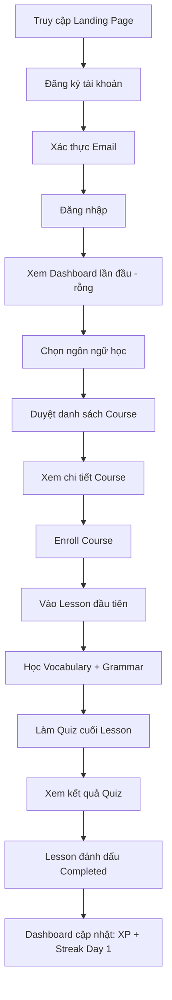
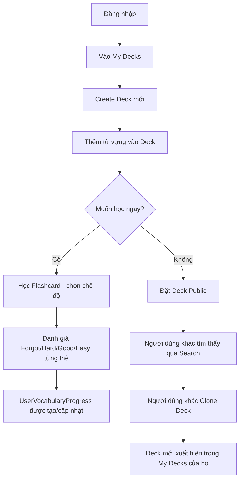
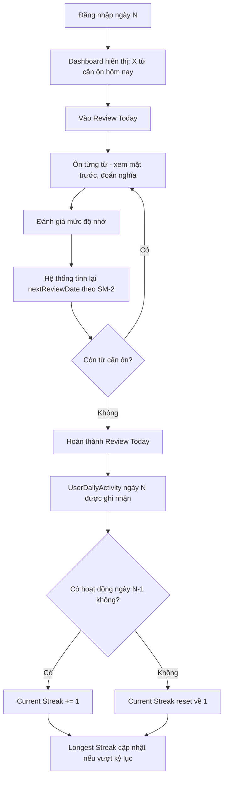
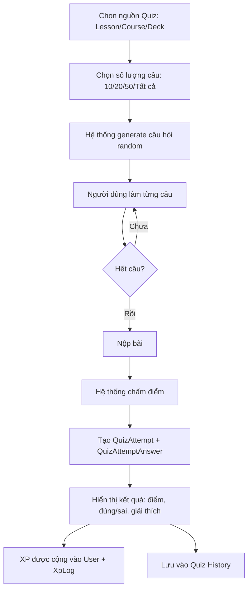
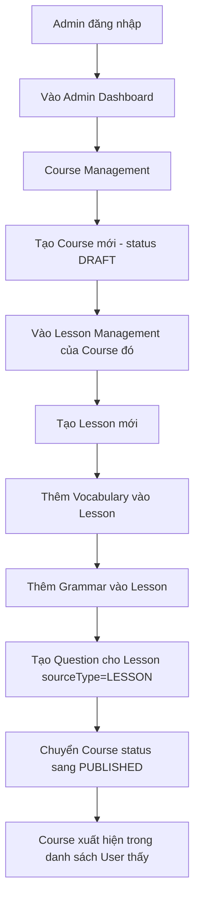
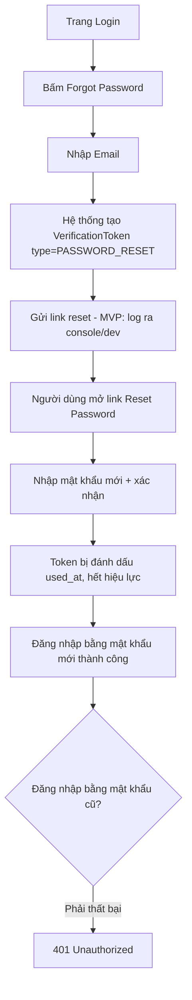
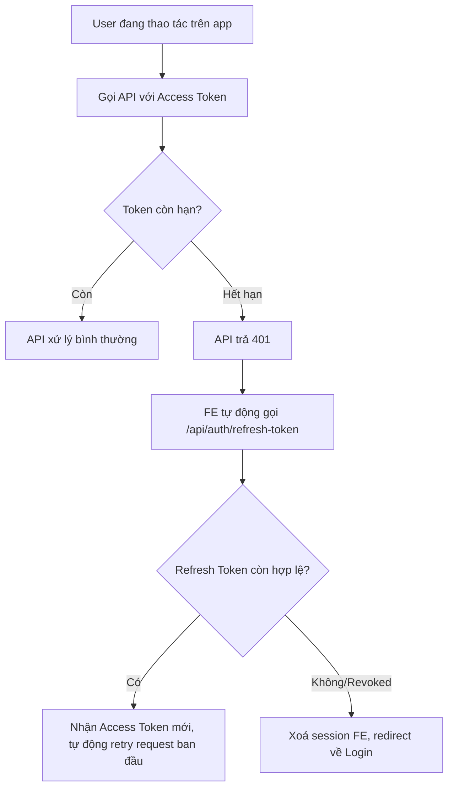

# User Flows — Luồng người dùng xuyên nhiều màn hình

> Thể hiện các luồng end-to-end đi qua nhiều module/màn hình, giúp tester hiểu bối cảnh trước khi test từng bước riêng lẻ trong các file `FRS_TC_*.md`. Mỗi flow dưới đây nên được test tối thiểu 1 lần dạng "happy path" đầy đủ (end-to-end) sau khi các module liên quan đã hoàn thành, ngoài các test case chi tiết theo từng module.

## 1. Flow: Người dùng mới — Đăng ký đến bài học đầu tiên

**Test case tham chiếu:** `11_FRS_TC_AUTH.md` (B→D), `13_FRS_TC_COURSE_LESSON.md` (F→N), `17_FRS_TC_PROGRESS_GAMIFICATION.md` (E, O).

## 2. Flow: Học bằng Deck cá nhân

**Test case tham chiếu:** `14_FRS_TC_DECK_FLASHCARD.md`, `15_FRS_TC_SRS_REVIEW.md` (G, H), `20_FRS_TC_SEARCH.md` (J).

## 3. Flow: Ôn tập hằng ngày (Review Today) & duy trì Streak

**Test case tham chiếu:** `15_FRS_TC_SRS_REVIEW.md`, `17_FRS_TC_PROGRESS_GAMIFICATION.md` (Streak).

## 4. Flow: Làm Quiz và xem kết quả

**Test case tham chiếu:** `16_FRS_TC_QUIZ.md`.

## 5. Flow: Admin tạo nội dung học tập mới

**Test case tham chiếu:** `21_FRS_TC_ADMIN.md`, `13_FRS_TC_COURSE_LESSON.md` (K — kiểm tra từ phía User).

## 6. Flow: Quên mật khẩu

**Test case tham chiếu:** `11_FRS_TC_AUTH.md`.

## 7. Flow: Access Token hết hạn giữa phiên làm việc

**Test case tham chiếu:** `11_FRS_TC_AUTH.md`.
